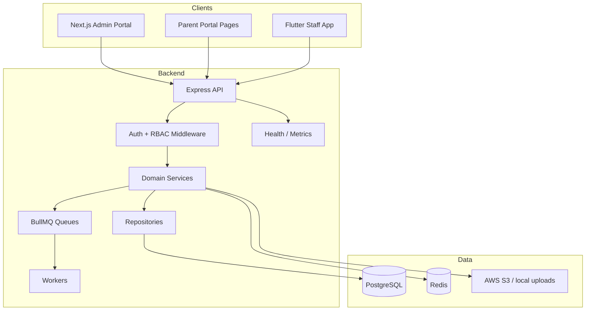
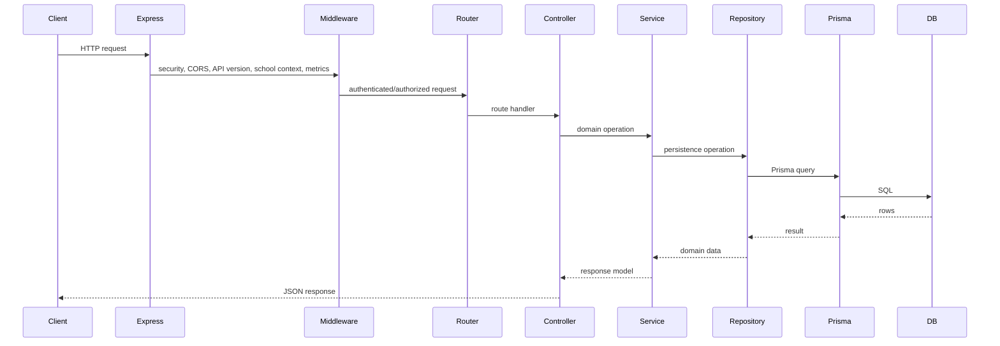
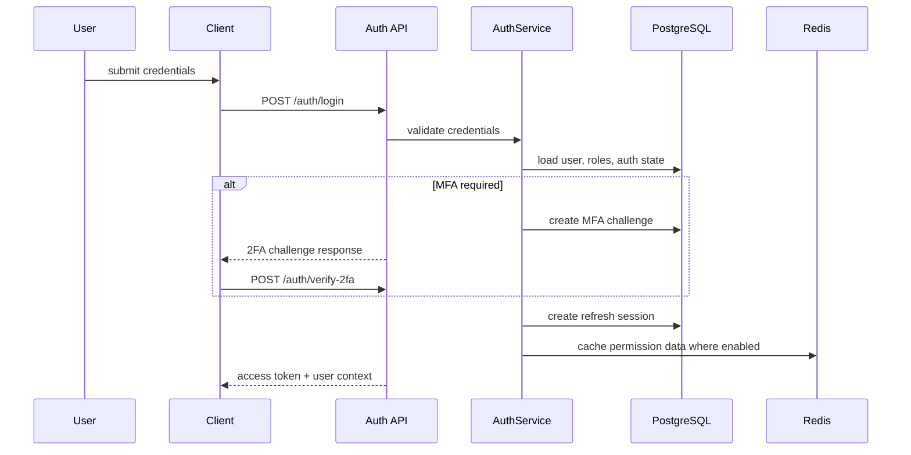
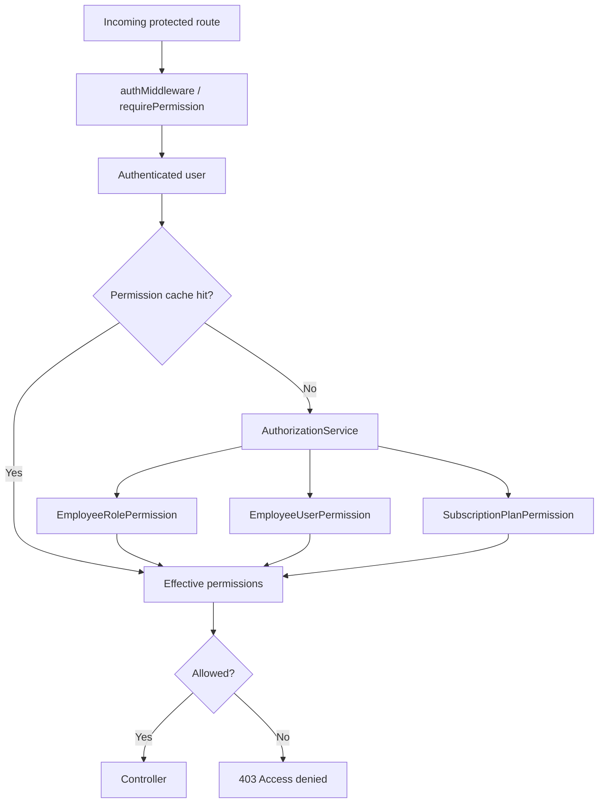
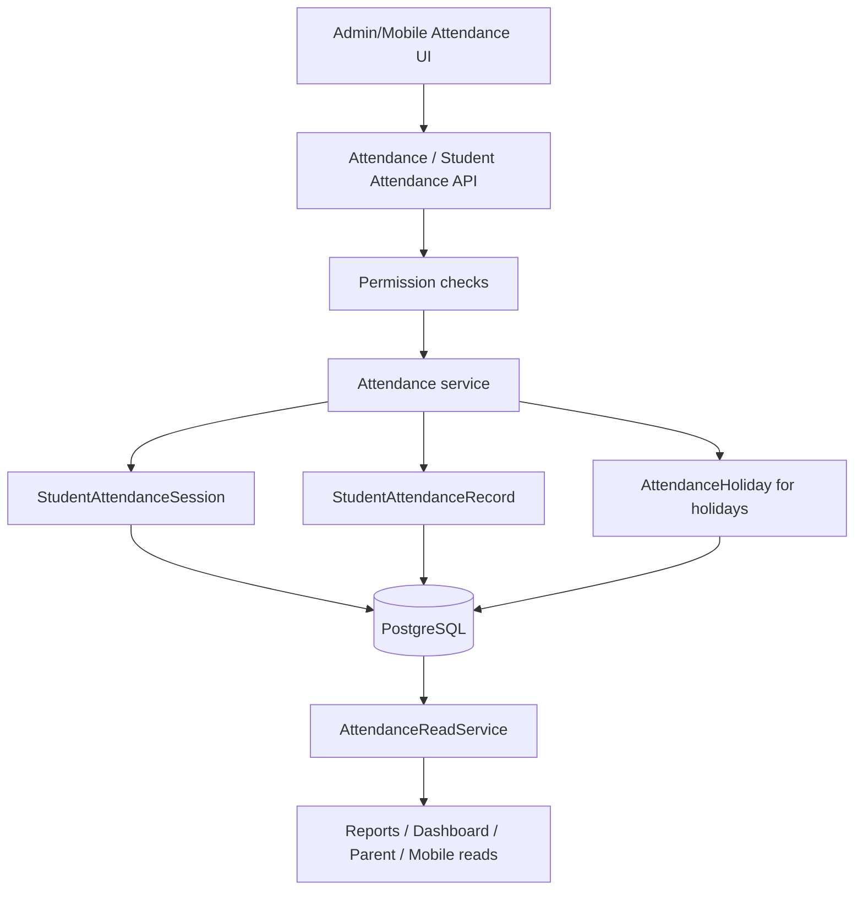
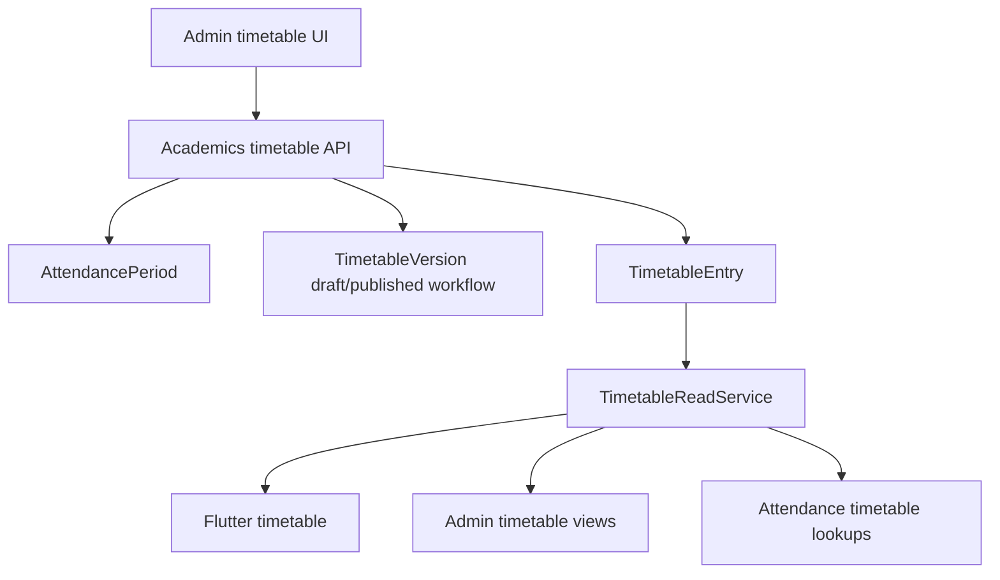
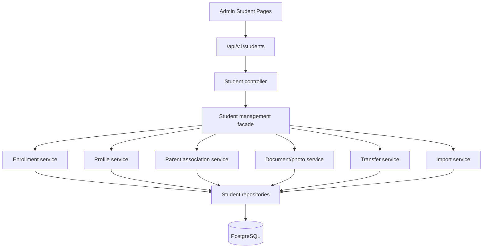
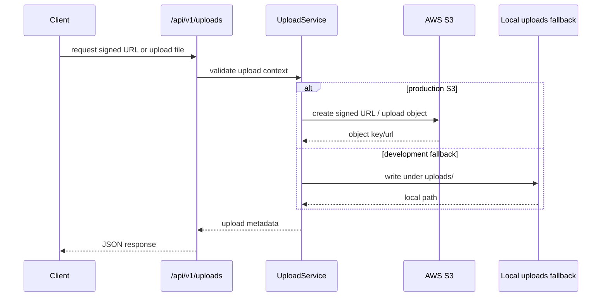
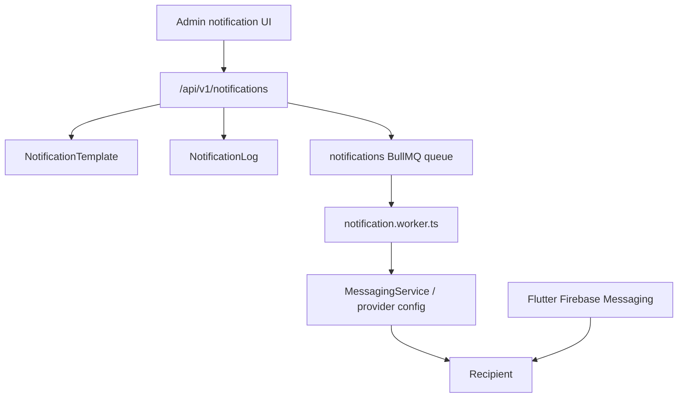

# Architecture

This document describes the architecture found in the repository. It documents implementation evidence only; missing or unstated areas are marked as "Not Found In Codebase".

## High Level Architecture

## Backend Request Flow

## Authentication Flow

## Authorization Flow

## Attendance Flow

Canonical student attendance storage is modernized around `StudentAttendanceSession` and `StudentAttendanceRecord`; holidays remain in `AttendanceHoliday`.

## Timetable Flow

Canonical timetable storage uses `AttendancePeriod`, `TimetableVersion`, and `TimetableEntry`.

## Student Management Flow

## File Upload Flow

## Notification Flow

## Observability Architecture

| Component | Implementation |
| --- | --- |
| Health checks | `GET /health` |
| Metrics | `GET /metrics`, Prometheus-compatible service |
| Request metrics | `requestMetricsMiddleware` |
| Prisma observability | `src/services/observability/prisma-observability.service.ts` |
| Redis metrics | `src/services/observability/redis-metrics.service.ts` |
| Queue metrics | `src/services/observability/queue-metrics.service.ts` |
| OpenTelemetry | Config flags and telemetry helper foundation; disabled by default |

## Missing Architecture Information

| Area | Status |
| --- | --- |
| Formal ADRs | Not Found In Codebase |
| Complete OpenAPI for every endpoint | Partial `backend/openapi.yaml` found |
| Infrastructure-as-code beyond Docker/GitHub Actions | Not Found In Codebase |
| Mobile production signing documentation | Not Found In Codebase |
