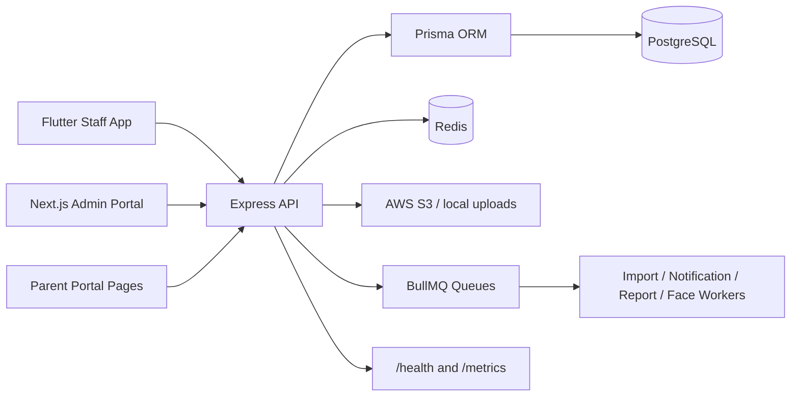

# SchoolApp

SchoolApp is a multi-tenant School ERP platform with a Node.js backend, a Next.js administration portal, and a Flutter staff mobile application. The implementation in this repository covers school administration, academics, attendance, timetable, student and staff management, fees, payroll, examinations, homework, library, transport, dormitory, notifications, reports, analytics, support, compliance, subscriptions, and backup operations.

## Project Overview

| Item | Implementation |
| --- | --- |
| Product name | SchoolApp / School ERP |
| Target users | Super admins, school admins, teachers, staff, parents, accountants, librarians, HR users |
| Tenancy model | School-scoped multi-tenant backend using school-aware middleware and `schoolId` fields across domain models |
| Backend | Express.js, TypeScript, Prisma, PostgreSQL, Redis, BullMQ |
| Admin portal | Next.js App Router, TypeScript, Tailwind CSS, TanStack Query |
| Mobile app | Flutter, Riverpod, GoRouter, Dio, Hive, Firebase Messaging |
| Storage | AWS S3 integration with local upload fallback in development |
| Notifications | Notification templates/logs, messaging service configuration, BullMQ notification queue, Firebase Messaging in mobile |

## Tech Stack

| Layer | Technology |
| --- | --- |
| Backend framework | Express.js 4 + TypeScript |
| Database ORM | Prisma 5 |
| Database | PostgreSQL |
| Cache/queue | Redis, ioredis, BullMQ |
| Authentication | JWT, refresh sessions, MFA/TOTP/email OTP, password reset |
| Authorization | Permission manifest, role permissions, employee role/user overrides, subscription-plan filtering |
| Admin frontend | Next.js 16, React 18, Tailwind CSS, TanStack Query/Table, React Hook Form, Zod |
| Mobile frontend | Flutter, Riverpod, GoRouter, Dio, Hive, secure storage |
| Cloud/storage | AWS S3 SDK |
| Observability | `/health`, `/metrics`, Prisma/Redis/queue metrics services, optional OpenTelemetry config |

## System Architecture



## Feature Overview

| Domain | Status in codebase | Evidence |
| --- | --- | --- |
| Authentication | Implemented | `backend/src/routes/auth.routes.ts`, `backend/src/modules/auth`, admin auth API routes, Flutter auth feature |
| MFA and sessions | Implemented | TOTP, backup code, 2FA, refresh, revoke session routes and services |
| Authorization/RBAC | Implemented | `backend/src/permissions`, `auth.middleware.ts`, `rbac.middleware.ts`, Flutter permission registry |
| School management | Implemented | `schoolAdmin.routes.ts`, admin schools pages |
| Academic setup | Implemented | Classes, sections, subjects, rooms, assign subjects, class teachers |
| Timetable | Implemented, modern canonical tables | `AttendancePeriod`, `TimetableVersion`, `TimetableEntry`, timetable services and admin/mobile pages |
| Attendance | Implemented, modern canonical tables | `AttendanceHoliday`, `StudentAttendanceSession`, `StudentAttendanceRecord`, self/staff attendance models |
| Student management | Implemented | Student controller, student module services/repositories, admin student pages |
| Staff/teacher management | Implemented | Staff and teacher routes/services/admin pages |
| Homework | Implemented | Homework routes/services/admin/mobile features |
| Exams and marks | Implemented | Exam routes/models/admin/mobile features |
| Fees | Implemented | Fee management routes, bounded services, repositories, admin pages |
| Payroll | Implemented | Staff payroll models/routes/admin pages |
| Library | Implemented | Library routes/models/admin pages |
| Transport | Implemented | Transport routes/models/admin pages |
| Dormitory | Implemented | Dormitory routes/models/admin pages |
| Notifications/messaging | Implemented | Notification routes, messaging service routes, workers, mobile notification feature |
| Reports/analytics | Implemented | Report and analytics routes/services/admin pages |
| AI assistant | Implemented with env gate | `AI_ASSISTANT_ENABLED`, AI assistant routes/services/admin page |
| Subscriptions/billing | Implemented | Subscription routes/models/admin pages |
| Compliance/support | Implemented | Consent, data export/deletion, support ticket routes/models/admin pages |
| Backup/restore | Implemented | Backup routes/models/services/admin pages |

## Repository Structure

```text
SchoolApp/
├── backend/          # Express + Prisma API
├── admin/            # Next.js admin portal and parent portal pages
├── school-flutter/   # Flutter staff mobile app
├── shared/           # Shared permission package/artifacts
├── docker/           # Backend and admin Dockerfiles
├── docs/             # Existing project documentation
├── documents/        # Generated/supporting documents
└── .github/          # CI/CD and architecture guard workflows
```

## Installation

### Backend

```bash
cd backend
cp .env.example .env
npm install
npx prisma generate
npx prisma migrate deploy
npm run dev
```

For local development with schema changes, use Prisma's development workflow:

```bash
npx prisma migrate dev
```

### Admin Portal

```bash
cd admin
npm install
npm run dev
```

The admin dev server is configured to run on port `3001`.

### Mobile App

```bash
cd school-flutter
flutter pub get
flutter run --dart-define=API_BASE_URL=http://127.0.0.1:4000/api/v1
```

## Environment Variables

### Backend

| Variable | Required | Purpose |
| --- | --- | --- |
| `NODE_ENV` | No | `development`, `test`, or `production` |
| `PORT` | No | API server port |
| `DATABASE_URL` | Yes | PostgreSQL connection string |
| `JWT_SECRET` | Yes | JWT signing secret, minimum 32 characters |
| `TOTP_ENCRYPTION_KEY` | Optional | MFA/TOTP encryption key |
| `AUTH_TWO_STEP_ENABLED` | No | Enables two-step auth flow |
| `REDIS_URL` | Yes | Redis connection for cache/queues |
| `OPENAI_API_KEY` | Optional | AI assistant key |
| `OPENAI_MODEL` | No | AI model name |
| `AI_ASSISTANT_ENABLED` | No | Enables AI assistant |
| `FRONTEND_URL` | No | Admin/frontend URL |
| `CORS_ORIGINS` | No | Comma-separated allowed origins |
| `LOG_LEVEL` | No | Pino log level |
| `METRICS_ENABLED` | No | Enables Prometheus metrics endpoint |
| `OTEL_ENABLED` | No | Enables OpenTelemetry tracing foundation |
| `PRISMA_SLOW_QUERY_THRESHOLD_MS` | No | Slow query threshold |
| `AWS_ACCESS_KEY_ID` | Yes | AWS S3 access key |
| `AWS_SECRET_ACCESS_KEY` | Yes | AWS S3 secret |
| `AWS_REGION` | Yes | S3 region |
| `AWS_S3_BUCKET` | Yes | S3 bucket name |

See `backend/src/config/env.ts` and `backend/.env.example`.

### Admin

| Variable | Required | Purpose |
| --- | --- | --- |
| `API_BASE_URL` | Production | Server-side API base URL |
| `NEXT_PUBLIC_API_BASE_URL` | Production/client | Client-side API base URL |

Development fallback is `http://127.0.0.1:3000/api/v1` in admin config.

### Mobile

| Value | Purpose |
| --- | --- |
| `--dart-define=API_BASE_URL=...` | Overrides Flutter API base URL |

Default in code is `https://schoolapp-6a6f.onrender.com/api/v1`.

## Build Commands

| App | Command |
| --- | --- |
| Backend build | `cd backend && npm run build` |
| Backend start | `cd backend && npm start` |
| Backend tests | `cd backend && npm test` |
| Admin build | `cd admin && npm run build` |
| Admin lint | `cd admin && npm run lint` |
| Mobile analyze | `cd school-flutter && flutter analyze` |
| Mobile tests | `cd school-flutter && flutter test` |
| Mobile Android debug | `cd school-flutter && flutter build apk --debug` |
| Mobile web debug | `cd school-flutter && flutter build web --debug` |

## Deployment Guide

The repository includes Dockerfiles for backend and admin under `docker/`, and a GitHub Actions deployment workflow at `.github/workflows/deploy-full-stack.yml`. The workflow builds Docker images, deploys to AWS Lightsail, and applies Prisma migrations with `npx prisma migrate deploy`.

See [Deployment.md](./Deployment.md) for the full deployment process.

## Architecture Docs

- [Hostinger KVM-2 architecture](./docs/architecture-hostinger-kvm2.md) for the pitch/pilot deployment shape using PM2, Nginx, Lightsail PostgreSQL, S3, Redis, Cloudflare, backups, and monitoring.
- [Architecture diagrams](./docs/architecture-diagrams.md) for Mermaid diagrams covering request flow, processes, deployment, monitoring, and upgrade path.
- [Staging deployment runbook](./docs/staging-deployment.md), [first-school launch checklist](./docs/first-school-launch-checklist.md), [backup and restore drill](./docs/backup-restore-drill.md), and [monitoring and alerting](./docs/monitoring-alerting.md) for launch operations.

## Security Features

- JWT authentication with refresh sessions.
- MFA/TOTP, email OTP, backup codes, session revocation, logout-all.
- Permission manifest with backend/admin/mobile permission usage.
- School-aware middleware for multi-tenant request context.
- Helmet, CORS, request size limits, API versioning, rate limiting.
- Route-level authorization middleware and subscription-plan filtering.
- Audit logs, audit exports, compliance exports/deletions.
- S3 signed upload support and upload validation routes.
- Metrics and health endpoints for operational monitoring.

## Testing

Backend Jest tests exist under `backend/src/**/__tests__` and module test folders. Flutter tests exist under `school-flutter/test`. Admin has linting and at least one service test file discovered under `admin/services/upload-url.test.ts`.

## License

Not Found In Codebase.

## Documentation Coverage Report

| Area | Coverage |
| --- | --- |
| Backend modules | Documented from route, service, Prisma, worker, and config files |
| Admin modules | Documented from App Router directories and service files |
| Mobile modules | Documented from Flutter feature/core folders and constants |
| API routes | Grouped and listed in [API-Overview.md](./API-Overview.md) |
| Deployment | Documented from Dockerfiles, package scripts, and GitHub Actions |
| Missing information | License, complete hand-written request/response examples for every controller, formal CI test matrix |
