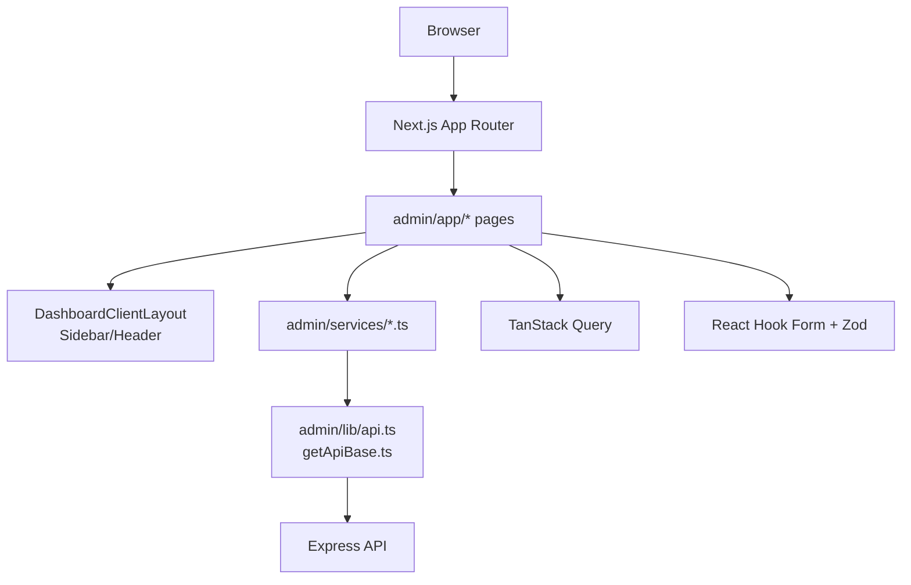
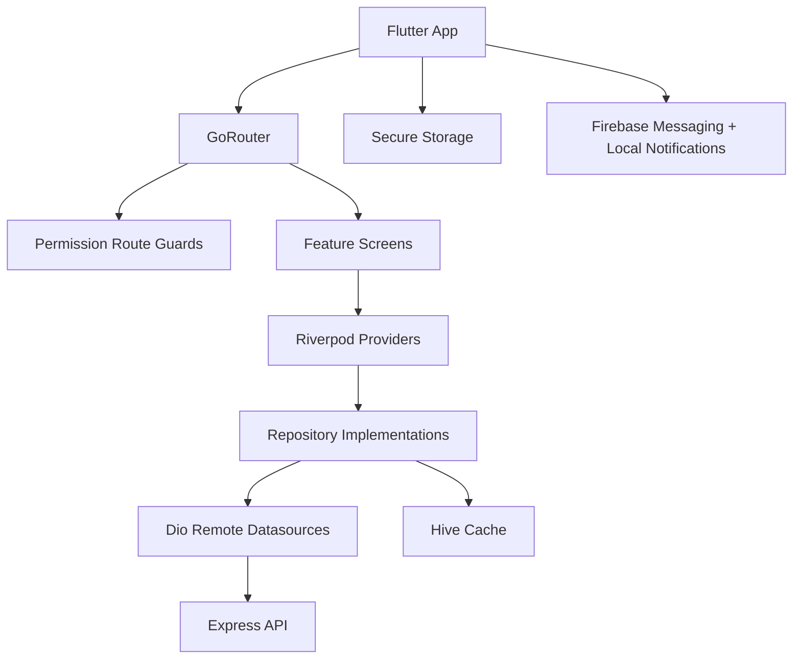
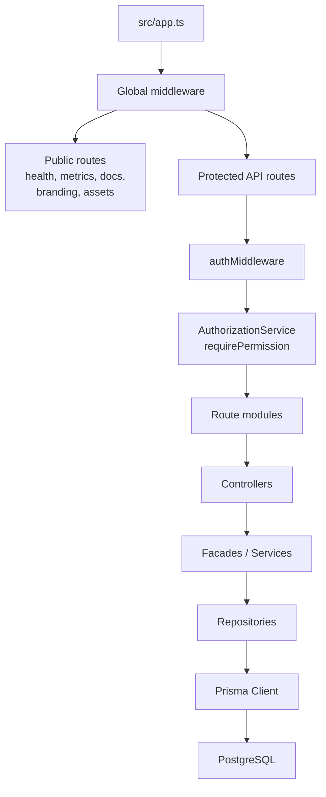
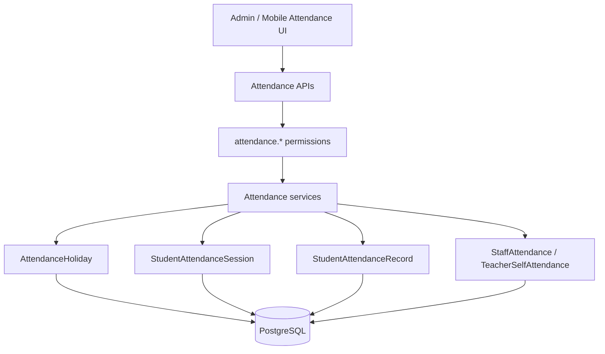
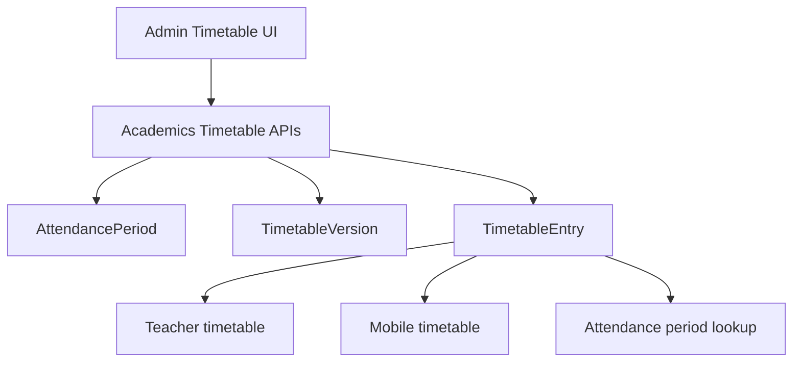
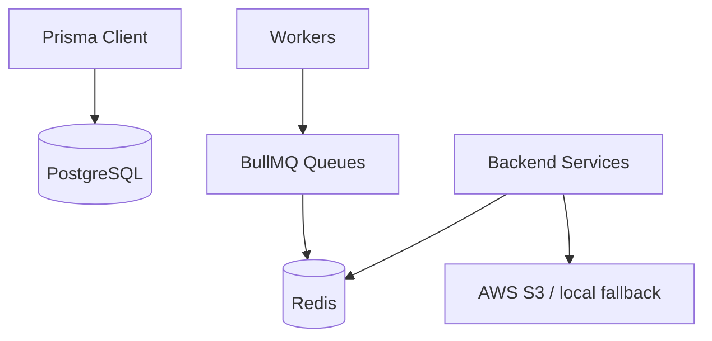
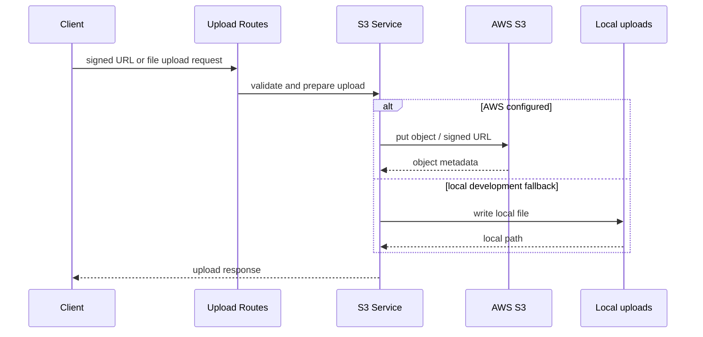
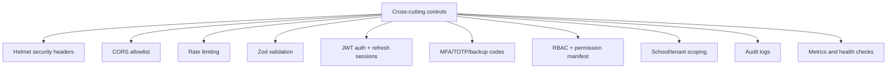
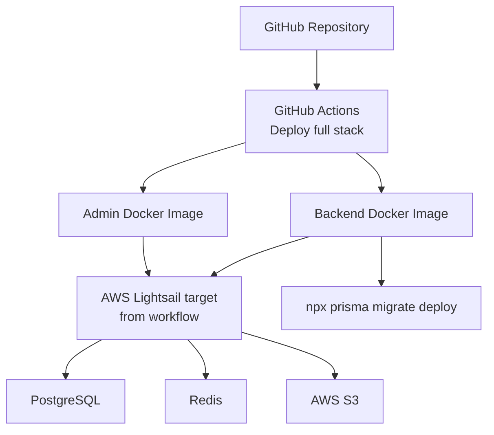

# SchoolApp — System Architecture (End-to-End)

Multi-tenant School ERP Platform

This document describes the implemented end-to-end architecture in this repository. It is intentionally visual and onboarding-focused, similar to a one-page system architecture board, while keeping all details grounded in the codebase.

## Architecture Board

```mermaid
flowchart LR
  subgraph Users["USERS"]
    SuperAdmin["Super Admins\nPlatform operations"]
    SchoolAdmin["School Admins\nInstitution management"]
    Teachers["Teachers / Staff\nDaily school operations"]
    Parents["Parents\nParent portal"]
    Students["Students\nManaged records"]
  end

  subgraph Admin["ADMIN PORTAL\nNext.js 16 + React 18 + TypeScript"]
    AdminRoutes["App Router Pages\n/dashboard/*\n/parent/*\n/auth pages"]
    AdminServices["Service Layer\nadmin/services/*.ts"]
    AdminUI["UI Components\nSidebar, Header,\nDashboard layout,\nForms, Tables"]
    AdminPerms["Permission-aware UI\nSidebar + access panels"]
  end

  subgraph Mobile["STAFF MOBILE APP\nFlutter + Riverpod + GoRouter"]
    MobileRoutes["Routes\nDashboard, Attendance,\nStudent Attendance,\nTimetable, Leave,\nHomework, Classes,\nExams, Marks"]
    MobileFeatures["Clean Feature Modules\ndata/domain/presentation"]
    MobileStorage["Local Storage\nHive + Secure Storage"]
    MobilePerms["Permission-driven Drawer\nRoute Guards"]
  end

  subgraph Backend["BACKEND API\nNode.js + Express + TypeScript"]
    Middleware["Middleware Stack\nHelmet, CORS, Rate Limit,\nSchool Domain,\nAPI Version,\nMetrics,\nAuth/RBAC"]
    Routes["Route Modules\n47 route files\n577 route declarations"]
    Controllers["Controllers\nRequest/response orchestration"]
    Services["Domain Services\nAuth, Students, Fees,\nAttendance, Timetable,\nReports, Notifications"]
    Repositories["Repositories\nFees, Students, Auth,\nselected domain persistence"]
    Observability["Observability\n/health, /metrics,\nPrisma/Redis/Queue metrics"]
  end

  subgraph Data["DATA LAYER"]
    Postgres["PostgreSQL\nPrisma schema"]
    Redis["Redis\nCache + BullMQ"]
    Uploads["AWS S3\nLocal fallback in dev"]
  end

  subgraph Workers["BACKGROUND WORKERS"]
    ImportWorker["Import Worker"]
    NotificationWorker["Notification Worker"]
    ReportWorker["Report Worker"]
    FaceWorker["Face Worker"]
    SubscriptionWorker["Subscription Worker"]
  end

  subgraph External["EXTERNAL / OPTIONAL SERVICES"]
    AWS["AWS S3"]
    OpenAI["OpenAI API\nAI Assistant"]
    Messaging["Messaging providers\nEmail/SMS/WhatsApp config"]
    Firebase["Firebase Messaging\nMobile push"]
  end

  Users --> Admin
  Users --> Mobile
  Admin -->|HTTPS REST API + JWT| Backend
  Mobile -->|HTTPS REST API + JWT| Backend
  Backend --> Middleware
  Middleware --> Routes
  Routes --> Controllers
  Controllers --> Services
  Services --> Repositories
  Repositories --> Postgres
  Services --> Redis
  Services --> Uploads
  Services --> Workers
  Workers --> Redis
  Workers --> Postgres
  Uploads --> AWS
  Services --> OpenAI
  Services --> Messaging
  Mobile --> Firebase
```



## System Boundary Summary

| Layer | Code location | Primary responsibility |
| --- | --- | --- |
| Admin portal | `admin/` | Web administration, parent portal pages, role/permission management, operational dashboards |
| Staff mobile app | `school-flutter/` | Teacher/staff workflows, attendance, timetable, leave, homework, exams, marks, offline-aware UX |
| Backend API | `backend/src/` | Authentication, authorization, ERP domain APIs, background jobs, uploads, observability |
| Database | `backend/prisma/schema.prisma` | Multi-tenant relational domain model |
| Shared permissions | `shared/`, `backend/src/permissions/` | Permission manifest and access-control definitions |
| Deployment | `.github/workflows/`, `docker/` | Dockerized backend/admin deployment workflow |

## Users and Access Model

| User type | Main entry point | Access control model |
| --- | --- | --- |
| Super admin | Admin portal | Platform/admin routes and super-admin guards |
| School admin | Admin portal | School-scoped RBAC and subscription permissions |
| Teacher/staff | Flutter app and admin pages | Effective permissions from backend role/user/plan evaluation |
| Parent | Parent portal pages | Parent portal auth/session routes |
| Student | Managed record | Student data is managed by school staff/admin users |

Access is not intended to be role-name hardcoded. The backend computes effective permissions using role permissions, employee role permissions, employee user overrides, and subscription-plan filtering. Admin and mobile consume permissions for menu visibility and route access.

## Admin Portal Architecture



### Admin Route Areas

| Area | Implemented paths |
| --- | --- |
| Auth | `/login`, `/[schoolCode]/login`, `/verify-2fa`, `/reset-password`, `/change-password` |
| Parent portal | `/parent/dashboard`, `/parent/attendance`, `/parent/exams`, `/parent/fees`, `/parent/notices`, `/parent/profile`, `/parent/subjects`, `/parent/timetable` |
| Dashboard | `/dashboard` |
| Academic | `/dashboard/academics`, `/dashboard/academics/exams`, `/dashboard/academics/marks`, `/dashboard/academics/timetable` |
| Attendance | `/dashboard/attendance`, `/dashboard/attendance/my`, `/dashboard/attendance/overview`, `/dashboard/attendance/students`, `/dashboard/attendance/locks` |
| Student/staff | `/dashboard/students/*`, `/dashboard/staff/*`, `/dashboard/teachers/*` |
| Finance | `/dashboard/fees/*`, `/dashboard/payroll`, `/dashboard/payroll/report` |
| Operations | Homework, library, transport, dormitory, leave, reports, analytics, support, backups, compliance |
| Platform | Schools, subscriptions, plans, themes, system health, users, role permissions, settings |

### Admin Service Layer

Representative service clients exist under `admin/services`:

| Service file | Domain |
| --- | --- |
| `academic.service.ts`, `academic-setup.service.ts` | Academics and setup |
| `attendance.service.ts`, `attendanceP1.service.ts` | Attendance |
| `student.service.ts`, `student-operations.service.ts` | Students |
| `staff.service.ts`, `teacher.service.ts` | Staff and teachers |
| `fee-management.service.ts` | Fees |
| `homework.service.ts`, `leave.service.ts` | Homework and leave |
| `library.service.ts`, `transport.service.ts`, `dormitory.service.ts` | Operations modules |
| `analytics.service.ts`, `report.service.ts` | Analytics and reports |
| `auth.service.ts`, `admin-user.service.ts`, `user.service.ts` | Authentication and users |
| `subscription.service.ts`, `school.service.ts` | Platform and school management |

## Mobile App Architecture



### Mobile Feature Modules

| Feature | Code location |
| --- | --- |
| Authentication | `school-flutter/lib/features/auth` |
| Dashboard | `school-flutter/lib/features/dashboard` |
| Staff attendance | `school-flutter/lib/features/attendance` |
| Student attendance | `school-flutter/lib/features/attendance` |
| Timetable | `school-flutter/lib/features/timetable` |
| Leave | `school-flutter/lib/features/leave` |
| Homework | `school-flutter/lib/features/homework` |
| Classes | `school-flutter/lib/features/classes` |
| Exams | `school-flutter/lib/features/exams` |
| Marks | `school-flutter/lib/features/marks` |
| Notices/communication | `school-flutter/lib/features/notices`, `school-flutter/lib/features/communication` |
| Notifications | `school-flutter/lib/features/notifications` |
| Profile/settings | `school-flutter/lib/features/profile`, `school-flutter/lib/features/settings` |

## Backend API Architecture



### Backend Middleware Stack

| Middleware/concern | Implementation |
| --- | --- |
| Security headers | `helmet()` |
| CORS | `cors()` using configured origins |
| Request body limits | `express.json({ limit: '10mb' })`, `express.urlencoded({ limit: '10mb' })` |
| Request metrics | `requestMetricsMiddleware` |
| Rate limiting | `rateLimit` |
| API versioning | `apiVersionMiddleware` |
| Tenant/school context | `schoolDomainMiddleware` |
| Write operation guard | `writeOperationGuard` |
| Authentication | `authMiddleware` |
| Authorization | `requirePermission`, route resolver, `AuthorizationService` |
| Validation | `validateBody`, `validateQuery`, `validateParams` with Zod |

## Backend Route Modules

The backend mounts route modules from `backend/src/routes`. The API overview documents 577 route declarations.

| Category | Route files |
| --- | --- |
| Auth/users | `auth.routes.ts`, `user.routes.ts`, `adminUser.routes.ts` |
| School/platform | `schoolAdmin.routes.ts`, `schoolOnboarding.routes.ts`, `adminDashboard.routes.ts`, `adminSystem.routes.ts` |
| Academics/timetable | `academic.routes.ts`, `academicSetup.routes.ts`, `teacherAssignment.routes.ts` |
| Attendance | `attendance.routes.ts`, `attendanceSummary.routes.ts`, `attendanceApproval.routes.ts`, `evidence.routes.ts` |
| Students/staff/teachers | `student.routes.ts`, `staff.routes.ts`, `teacher.routes.ts` |
| Fees/payroll | `feeManagement.routes.ts`, staff payroll routes |
| Exams/homework/leave | `exam.routes.ts`, `homework.routes.ts`, `leave.routes.ts` |
| Operations | `library.routes.ts`, `transport.routes.ts`, `dormitory.routes.ts` |
| Reports/analytics/AI | `report.routes.ts`, `analytics.routes.ts`, `aiAssistant.routes.ts` |
| Notifications/uploads/imports/jobs | `notification.routes.ts`, `upload.routes.ts`, `import.routes.ts`, `job.routes.ts` |
| Compliance/audit/support | `auditLog.routes.ts`, `consent.routes.ts`, `dataCompliance.routes.ts`, `ticket.routes.ts` |
| Subscriptions/features/themes | `subscription.routes.ts`, `subscriptionPlan.routes.ts`, `subscriptionMetrics.routes.ts`, `feature-flag.routes.ts`, `theme.routes.ts` |
| Face/recognition | `face.routes.ts`, `recognition.routes.ts` |
| Public/system | `publicAsset.routes.ts`, `publicBranding.routes.ts`, `schoolDomain.routes.ts`, `schoolSystemSettings.routes.ts` |

## Core Domain Architecture

### Attendance



Canonical attendance storage:

| Concept | Canonical model |
| --- | --- |
| Student attendance session | `StudentAttendanceSession` |
| Student attendance row | `StudentAttendanceRecord` |
| Holiday | `AttendanceHoliday` |
| Teacher self attendance | `TeacherSelfAttendance` |
| Staff attendance | `StaffAttendance` |

### Timetable



Canonical timetable storage:

| Concept | Canonical model |
| --- | --- |
| Periods | `AttendancePeriod` |
| Draft/published timetable | `TimetableVersion` |
| Timetable slot | `TimetableEntry` |
| Room relation | `TimetableEntry.classRoomId` and `ClassRoom` |

### Fees

The fee domain is decomposed under `backend/src/modules/fees`.

```text
Controller -> FeeManagementFacade -> bounded fee services -> fee repositories -> Prisma
```

Service areas include collection, invoice, discount, fine, assignment, structure, schedule, reporting, and audit.

### Students

The student domain is decomposed under `backend/src/modules/students`.

```text
Controller -> StudentManagementFacade -> bounded student services -> student repositories -> Prisma
```

Service areas include enrollment, profile, parent association, documents, timeline, transfers, imports, and audit.

### Auth

The auth domain is decomposed under `backend/src/modules/auth`.

```text
Auth routes -> Auth controller/service facade -> login/session/MFA/password/token services -> auth repositories
```

Auth capabilities include login, refresh sessions, logout, logout-all, password reset, password change, MFA/TOTP, backup codes, and session revocation.

## Data Layer



### Major Database Domains

| Domain | Representative models |
| --- | --- |
| Tenancy | `School`, `AcademicYear`, `Term` |
| Auth/RBAC | `User`, `Role`, `Permission`, `RolePermission`, `EmployeeRolePermission`, `EmployeeUserPermission` |
| Academics | `Class`, `Section`, `ClassSection`, `Subject`, `AssignSubject`, `ClassTeacher`, `ClassRoom` |
| Attendance | `AttendanceHoliday`, `StudentAttendanceSession`, `StudentAttendanceRecord`, `StaffAttendance`, `TeacherSelfAttendance` |
| Timetable | `AttendancePeriod`, `TimetableVersion`, `TimetableEntry` |
| Students/parents | `Student`, `ParentGuardian`, `StudentParent`, `StudentEnrollment`, `StudentDocument`, `StudentTimeline` |
| Staff/teachers | `TeacherProfile`, `Department`, `Designation`, staff document/payroll/timeline models |
| Fees/payroll | Fee structure/invoice/payment/ledger models, payroll models |
| Exams/marks | `Exam`, `ExamPaper`, `ExamCenter`, `ExamRoom`, `Mark`, moderation/revaluation models |
| Operations | Homework, library, transport, dormitory models |
| Governance | Audit, compliance, consent, backup, support, subscription models |

## Background Processing

| Queue/worker | Code location | Purpose |
| --- | --- | --- |
| Face processing | `backend/src/workers/face.worker.ts` | Face profile/sample processing |
| Imports | `backend/src/workers/import.worker.ts` | Import jobs |
| Notifications | `backend/src/workers/notification.worker.ts` | Notification delivery jobs |
| Reports | `backend/src/workers/report.worker.ts` | Report generation |
| Subscriptions | `backend/src/workers/subscription.worker.ts` | Subscription worker started from `server.ts` |

Queues are defined in `backend/src/queues/index.ts`.

## File Upload and Storage



Upload routes include signed URLs, branding uploads, photos, and documents.

## Observability

| Capability | Implementation |
| --- | --- |
| Health checks | `GET /health` |
| Metrics | `GET /metrics` |
| Request metrics | `requestMetricsMiddleware` |
| Prisma metrics | `prisma-observability.service.ts` |
| Redis metrics | `redis-metrics.service.ts` |
| Queue metrics | `queue-metrics.service.ts` |
| OpenTelemetry foundation | `OTEL_ENABLED`, `OTEL_SERVICE_NAME` env config |
| Logging | Pino logger |

## Security and Cross-Cutting Concerns



## Deployment Architecture



Deployment evidence in codebase:

| Area | Evidence |
| --- | --- |
| Backend Docker | `docker/backend/Dockerfile` |
| Admin Docker | `docker/admin/Dockerfile` |
| CI/CD | `.github/workflows/deploy-full-stack.yml` |
| PR governance | `.github/workflows/pr-architecture-guard.yml` |

## Environment Configuration

### Backend

Validated in `backend/src/config/env.ts`:

| Group | Variables |
| --- | --- |
| Runtime | `NODE_ENV`, `PORT`, `LOG_LEVEL` |
| Database/cache | `DATABASE_URL`, `REDIS_URL` |
| Auth | `JWT_SECRET`, `TOTP_ENCRYPTION_KEY`, `AUTH_TWO_STEP_ENABLED`, `OTP_EXPOSE_CODE_IN_DEV` |
| AI | `OPENAI_API_KEY`, `OPENAI_MODEL`, `AI_ASSISTANT_ENABLED`, `AI_ASSISTANT_REQUIRE_CONFIRMATION` |
| Frontend/CORS | `FRONTEND_URL`, `CORS_ORIGINS` |
| Cache toggles | `REDIS_CACHE_*`, `REDIS_AUTHZ_CACHE_ENABLED` |
| Observability | `METRICS_ENABLED`, `OTEL_ENABLED`, `OTEL_SERVICE_NAME`, `PRISMA_SLOW_QUERY_THRESHOLD_MS` |
| Feature toggles | `ATTENDANCE_ENABLED`, `TEACHER_SELF_ATTENDANCE_ENABLED`, `LEAVE_BASIC_ENABLED` |
| Messaging/storage | `WHATSAPP_FALLBACK_TO`, AWS S3 variables |

### Admin

| Variable | Purpose |
| --- | --- |
| `API_BASE_URL` | Server-side API base |
| `NEXT_PUBLIC_API_BASE_URL` | Browser API base |

### Mobile

| Dart define | Purpose |
| --- | --- |
| `API_BASE_URL` | Backend API base URL |

## Canonical Storage Decisions

| Domain | Canonical storage |
| --- | --- |
| Student attendance | `StudentAttendanceSession`, `StudentAttendanceRecord` |
| Attendance holidays | `AttendanceHoliday` |
| Timetable periods | `AttendancePeriod` |
| Timetable versions | `TimetableVersion` |
| Timetable slots | `TimetableEntry` |

Retired legacy attendance/timetable models are no longer documented as canonical runtime storage.

## Current Documentation Links

| Document | Purpose |
| --- | --- |
| [README.md](./README.md) | Root project overview |
| [backend/README.md](./backend/README.md) | Backend documentation |
| [admin/README.md](./admin/README.md) | Admin portal documentation |
| [school-flutter/README.md](./school-flutter/README.md) | Mobile app documentation |
| [Architecture.md](./Architecture.md) | Detailed architecture flows |
| [API-Overview.md](./API-Overview.md) | Route overview and raw route appendix |
| [Deployment.md](./Deployment.md) | Deployment process |

