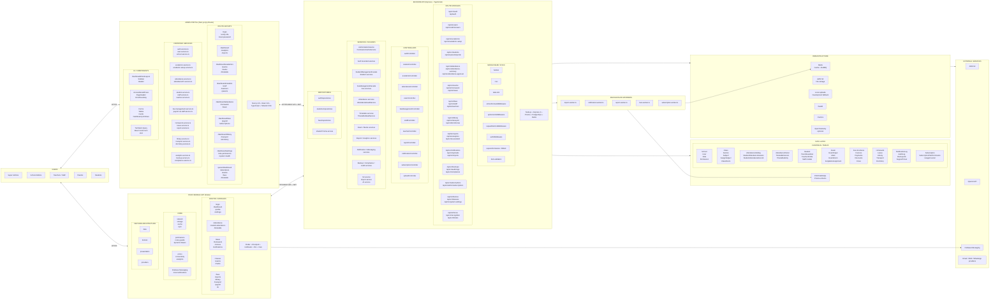

# SchoolApp — System Architecture (End-to-End)

```mermaid
flowchart LR
  subgraph Users["USERS"]
    U1["Super Admins"]
    U2["School Admins"]
    U3["Teachers / Staff"]
    U4["Parents"]
    U5["Students"]
  end

  subgraph Admin["ADMIN PORTAL (Next.js App Router)"]
    A0["Next.js 16 + React 18 + TypeScript + Tailwind CSS"]

    subgraph AdminRoutes["ROUTE GROUPS"]
      A1["/login\n/verify-2fa\n/reset-password"]
      A2["/dashboard\n/analytics\n/reports"]
      A3["/dashboard/academics\n/exams\n/marks\n/timetable"]
      A4["/dashboard/students\n/staff\n/teachers\n/parents"]
      A5["/dashboard/attendance\n/homework\n/leave"]
      A6["/dashboard/fees\n/payroll\n/subscriptions"]
      A7["/dashboard/library\n/transport\n/dormitory"]
      A8["/dashboard/settings\n/role-permissions\n/system-health"]
      A9["/parent/dashboard\n/attendance\n/exams\n/fees\n/timetable"]
    end

    subgraph AdminServices["FRONTEND SERVICES"]
      AS1["auth.service.ts\nuser.service.ts\nschool.service.ts"]
      AS2["academic.service.ts\nacademic-setup.service.ts"]
      AS3["attendance.service.ts\nattendanceP1.service.ts"]
      AS4["student.service.ts\nstaff.service.ts\nteacher.service.ts"]
      AS5["fee-management.service.ts\npayroll via staff.service.ts"]
      AS6["homework.service.ts\nleave.service.ts\nreport.service.ts"]
      AS7["library.service.ts\ntransport.service.ts\ndormitory.service.ts"]
      AS8["analytics.service.ts\nbackup.service.ts\ncompliance.service.ts"]
    end

    subgraph AdminUI["UI / COMPONENTS"]
      AU1["DashboardClientLayout\nSidebar\nHeader"]
      AU2["AccessDeniedPanel\nPageHeader\nErrorBoundary"]
      AU3["Forms\nTables\nCards\nDashboard primitives"]
      AU4["TanStack Query\nReact Hook Form\nZod"]
    end
  end

  subgraph Mobile["STAFF MOBILE APP (Flutter)"]
    M0["Flutter + Riverpod + GoRouter + Dio + Hive"]

    subgraph MobileRoutes["ROUTES / MODULES"]
      M1["/login\n/dashboard\n/profile\n/settings"]
      M2["/attendance\n/student-attendance\n/timetable"]
      M3["/leave\n/homework\n/notices\n/notifications"]
      M4["/classes\n/exams\n/marks"]
      M5["/fees\n/reports\n/library\n/transport\n/payroll\n/hr"]
    end

    subgraph MobileCore["CORE"]
      MC1["network\nstorage\ncache\nsync"]
      MC2["permissions\nroute guards\ndynamic drawer"]
      MC3["errors\nconnectivity\nanalytics"]
      MC4["Firebase Messaging\nlocal notifications"]
    end

    subgraph MobileFeatures["FEATURE ARCHITECTURE"]
      MF1["data"]
      MF2["domain"]
      MF3["presentation"]
      MF4["providers"]
    end
  end

  subgraph Backend["BACKEND API (Express + TypeScript)"]
    B0["Node.js + Express 4 + Prisma + PostgreSQL + Redis"]

    subgraph Middleware["MIDDLEWARE STACK"]
      BM1["helmet"]
      BM2["cors"]
      BM3["rateLimit"]
      BM4["schoolDomainMiddleware"]
      BM5["apiVersionMiddleware"]
      BM6["requestMetricsMiddleware"]
      BM7["authMiddleware"]
      BM8["requirePermission / RBAC"]
      BM9["Zod validation"]
    end

    subgraph Routes["ROUTE MODULES"]
      R1["/api/v1/auth\n/api/auth"]
      R2["/api/v1/users\n/api/v1/admin/users"]
      R3["/api/v1/academics\n/api/v1/academic-setup"]
      R4["/api/v1/students\n/api/v1/parents/portal"]
      R5["/api/v1/attendance\n/api/v1/attendance-summary\n/api/v1/attendance-approval"]
      R6["/api/v1/exams\n/api/v1/homework\n/api/v1/leave"]
      R7["/api/v1/fees\n/api/v1/staff\n/api/v1/teachers"]
      R8["/api/v1/library\n/api/v1/transport\n/api/v1/dormitories"]
      R9["/api/v1/reports\n/api/v1/analytics\n/api/v1/ai-assistant"]
      R10["/api/v1/notifications\n/api/v1/uploads\n/api/v1/imports"]
      R11["/api/v1/backups\n/api/v1/audit-logs\n/api/v1/compliance"]
      R12["/api/v1/subscriptions\n/api/v1/admin/subscriptions"]
      R13["/api/v1/themes\n/api/v1/features\n/api/v1/system-settings"]
      R14["/api/v1/faces\n/api/v1/recognition\n/api/v1/tickets"]
    end

    subgraph Controllers["CONTROLLERS"]
      C1["authController"]
      C2["studentController"]
      C3["academicController"]
      C4["attendanceController"]
      C5["examController"]
      C6["feeManagementController"]
      C7["staffController"]
      C8["teacherController"]
      C9["reportController"]
      C10["notificationController"]
      C11["subscriptionController"]
      C12["uploadController"]
    end

    subgraph Services["SERVICES / FACADES"]
      S1["AuthorizationService\nPermissionCacheService"]
      S2["Auth bounded services"]
      S3["StudentManagementFacade\nStudent services"]
      S4["FeeManagementFacade\nFee services"]
      S5["Attendance services\nAttendanceReadService"]
      S6["Timetable services\nTimetableReadService"]
      S7["Exam / Marks services"]
      S8["Report / Analytics services"]
      S9["Notification / Messaging services"]
      S10["Backup / Compliance / Audit services"]
      S11["S3 service\nImport service\nAI service"]
    end

    subgraph Repositories["REPOSITORIES"]
      REP1["auth/repositories"]
      REP2["students/repositories"]
      REP3["fees/repositories"]
      REP4["shared Prisma access"]
    end
  end

  subgraph Data["DATA LAYER"]
    DB["POSTGRESQL\nPrisma schema"]

    subgraph Canonical["CANONICAL TABLES"]
      D1["School\nUser\nRole\nPermission"]
      D2["Class\nSection\nSubject\nAssignSubject\nClassRoom"]
      D3["AttendanceHoliday\nStudentAttendanceSession\nStudentAttendanceRecord"]
      D4["AttendancePeriod\nTimetableVersion\nTimetableEntry"]
      D5["Student\nParentGuardian\nTeacherProfile\nStaff models"]
      D6["Exam\nExamPaper\nMark\nExamRoom\nInvigilatorAssignment"]
      D7["Fee structures\nInvoices\nPayments\nDiscounts\nFines"]
      D8["Homework\nLeave\nLibrary\nTransport\nDormitory"]
      D9["NotificationLog\nAuditLog\nBackupJob\nSupportTicket"]
      D10["Subscription\nSubscriptionPlanPermission\nUsageCounter"]
    end
  end

  subgraph Infra["INFRASTRUCTURE"]
    I1["Redis\nCache + BullMQ"]
    I2["AWS S3\nFile storage"]
    I3["Local uploads\nDevelopment fallback"]
    I4["/health"]
    I5["/metrics"]
    I6["OpenTelemetry\noptional"]
  end

  subgraph Workers["BACKGROUND WORKERS"]
    W1["import.worker.ts"]
    W2["notification.worker.ts"]
    W3["report.worker.ts"]
    W4["face.worker.ts"]
    W5["subscription.worker.ts"]
  end

  subgraph External["EXTERNAL SERVICES"]
    E1["AWS S3"]
    E2["OpenAI API"]
    E3["Firebase Messaging"]
    E4["Email / SMS / WhatsApp providers"]
  end

  Users <-->|HTTPS| Admin
  Users <-->|HTTPS| Mobile
  Admin <-->|HTTPS REST API + JWT| Backend
  Mobile <-->|HTTPS REST API + JWT| Backend

  Backend --> Data
  Backend --> Infra
  Backend --> Workers
  Workers --> I1
  Workers --> DB
  Infra --> External
  Mobile --> E3
```

