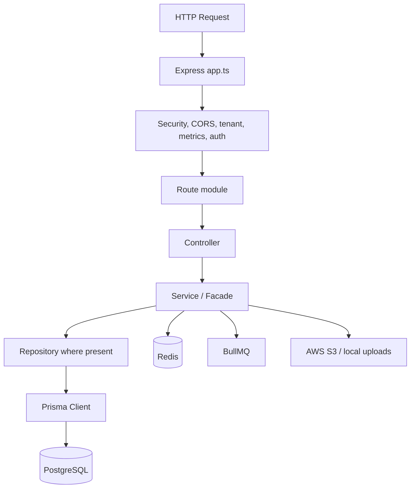

# Backend README

## Backend Overview

The backend is an Express.js and TypeScript API for a multi-tenant School ERP. It uses Prisma with PostgreSQL, Redis for cache and BullMQ queues, AWS S3 for object storage, JWT authentication, MFA support, permission-based authorization, health checks, metrics, and background workers.

## Technology Stack

| Area | Implementation |
| --- | --- |
| Runtime | Node.js |
| Framework | Express.js 4 |
| Language | TypeScript |
| ORM | Prisma 5 |
| Database | PostgreSQL |
| Cache | Redis / ioredis |
| Queues | BullMQ |
| Validation | Zod |
| Auth | JWT, bcryptjs, refresh sessions, MFA/TOTP |
| Uploads | Multer, AWS S3 SDK, local development fallback |
| Logging | Pino |
| API docs | Swagger UI served from `openapi.yaml` at `/docs` |

## Folder Structure

```text
backend/
├── prisma/                 # Prisma schema, migrations, seed scripts
├── src/
│   ├── app.ts              # Express app composition and route mounting
│   ├── server.ts           # Runtime bootstrap
│   ├── config/             # env, db, redis, logger
│   ├── controllers/        # Route controllers
│   ├── middlewares/        # Auth, RBAC, metrics, API version, tenant middleware
│   ├── modules/            # Bounded modules for auth, fees, students, attendance, timetable
│   ├── permissions/        # Permission manifest and catalog
│   ├── queues/             # BullMQ queue definitions
│   ├── routes/             # Express routers
│   ├── services/           # Application services and integrations
│   ├── utils/              # Utilities
│   ├── validations/        # Zod schemas
│   └── workers/            # Background workers
├── openapi.yaml            # Partial OpenAPI document served by Swagger UI
└── package.json
```

## Architecture



The fee, student, and auth domains use decomposed services and repositories. Attendance and timetable are canonicalized around modern read/write models:

- Attendance: `AttendanceHoliday`, `StudentAttendanceSession`, `StudentAttendanceRecord`, plus staff/teacher attendance models.
- Timetable: `AttendancePeriod`, `TimetableVersion`, `TimetableEntry`.

## Database Design

The Prisma schema defines models for:

| Domain | Prisma models discovered |
| --- | --- |
| School/tenant | `School`, `AcademicYear`, `Term`, school onboarding/status fields |
| Identity/auth | `User`, `Role`, `Permission`, `UserRole`, `RolePermission`, `RefreshSession`, `PasswordResetToken`, `MfaChallenge`, `TotpCredential`, `TotpBackupCode` |
| Employee permissions | `EmployeeRolePermission`, `EmployeeUserPermission` |
| Academics | `Class`, `Section`, `ClassSection`, `Subject`, `ClassRoom`, `AssignSubject`, `ClassTeacher` |
| Timetable | `AttendancePeriod`, `TimetableVersion`, `TimetableEntry` |
| Students | `Student`, `ParentGuardian`, `StudentEnrollment`, `StudentGroup`, `StudentCategory`, `StudentPromotion`, `StudentDocument`, `StudentTimeline`, `StudentSibling`, `StudentPhoto`, `StudentTransferRequest` |
| Attendance | `AttendanceHoliday`, `StudentAttendanceSession`, `StudentAttendanceRecord`, `TeacherSelfAttendance`, `StaffAttendance`, `StaffAttendanceHoliday`, `TeacherAttendanceSubstitution`, `AttendanceSession`, `AttendanceRecord`, `AttendanceEvidence`, `AttendanceAudit` |
| Staff/teachers | `TeacherProfile`, `TeacherOnboarding`, `TeacherBankDetails`, `Department`, `Designation`, `TeacherClassAssignment`, `TeacherSubjectAssignment`, staff profile/payroll/document/timeline models |
| Leave/payroll | `LeaveType`, `LeaveDefine`, `LeaveApplication`, `LeaveAttachment`, `LeaveBalance`, `LeaveStatusHistory`, `Payroll`, `PayrollEarning`, `PayrollDeduction`, `PayrollPayment` |
| Homework/library/transport/dormitory | `Homework`, `HomeworkEvaluation`, `LibraryBook*`, `LibraryMember`, `LibraryIssue`, `Transport*`, `Dormitory*` |
| Exams/marks | `Exam`, `ExamTypeConfig`, `ExamGradingSetting`, `ExamPaper`, `ExamCenter`, `ExamRoom`, `ExamSeatingAllocation`, `ExamInvigilatorAssignment`, `Mark`, `MarkModeration`, `MarkRevaluation` |
| Fees | Fee type, particular, structure, assignment, invoice, payment, discount, fine, ledger/reporting models |
| Notifications/messaging | `NotificationTemplate`, `NotificationLog`, `MessagingService`, `SchoolMessagingConfig` |
| Subscriptions/billing | `Subscription`, `SubscriptionPlanDef`, `SubscriptionPlanPermission`, `UsageCounter`, `SubscriptionInvoice`, `SubscriptionPayment` |
| Compliance/support/audit | `AuditLog`, `AuditExport`, `ConsentDocument`, `ConsentRecord`, `DataExportJob`, `DataDeletionJob`, `SupportTicket`, `TicketComment` |
| Backup/restore | `BackupJob`, `RestoreJob` |
| AI | `AiConversation`, `AiMessage`, `AiPendingAction` |

## Authentication

Authentication routes are mounted at `/api/v1/auth` and `/api/auth`.

Implemented flows:

- Login.
- Two-factor verification and resend.
- TOTP setup, verify, disable, and TOTP login verification.
- Password forgot/reset.
- Password change.
- Refresh token.
- Logout.
- Session listing, revoke session, logout-all.

Relevant files:

- `src/routes/auth.routes.ts`
- `src/modules/auth/services`
- `src/modules/auth/repositories`
- `src/services/auth*.ts`
- `src/services/totp.service.ts`
- `src/services/password-reset.service.ts`

## Authorization

Authorization uses a permission manifest and effective permission evaluation.

| Component | Purpose |
| --- | --- |
| `src/permissions/permission-manifest.ts` | Canonical permission codes and manifest |
| `src/middlewares/auth.middleware.ts` | Authenticates request and resolves route access |
| `src/middlewares/rbac.middleware.ts` | `requirePermission` authorization middleware |
| `src/services/authorization.service.ts` | Effective permission evaluation |
| `src/services/permission-cache.service.ts` | Redis-backed authorization caching |
| Prisma permission models | Role, permission, role permission, employee overrides, plan permissions |

Permission domains include academic setup, exams/marks, AI, attendance, audit, compliance, dashboard, dormitory, fees, homework, jobs, leave, library, payroll, plans, reports, school onboarding, settings, staff, students, support, teachers, and transport.

## API Modules

Routes are mounted in `src/app.ts`.

| Prefix | Router |
| --- | --- |
| `/api/v1/auth`, `/api/auth` | Authentication |
| `/api/v1/academics` | Modern academic/timetable APIs |
| `/api/v1/academic-setup` | Academic setup compatibility APIs |
| `/api/v1/students` | Student management and student attendance |
| `/api/v1/attendance` | Attendance summary, self attendance, P1 attendance |
| `/api/v1/attendance-summary` | Attendance summary APIs |
| `/api/v1/attendance-approval` | Attendance approval/rejection |
| `/api/v1/attendance/evidence` | Attendance evidence |
| `/api/v1/exams` | Exams, marks, seating, invigilation |
| `/api/v1/fees` | Fee management |
| `/api/v1/homework` | Homework |
| `/api/v1/leave` | Leave types, balances, applications |
| `/api/v1/library` | Library |
| `/api/v1/transport` | Transport |
| `/api/v1/dormitories` | Dormitory |
| `/api/v1/reports` | Reports |
| `/api/v1/analytics` | Analytics |
| `/api/v1/notifications` | Notifications |
| `/api/v1/uploads` | Upload URLs/files |
| `/api/v1/backups` | Backup/restore |
| `/api/v1/subscriptions` | School subscription management |
| `/api/v1/admin/*` | Super-admin and platform administration |
| `/api/v1/parents/portal` | Parent portal APIs |
| `/api/v1/ai-assistant` | AI assistant |
| `/health`, `/metrics`, `/docs` | Infrastructure endpoints |

See [../API-Overview.md](../API-Overview.md).

## Queue System

`src/queues/index.ts` defines BullMQ queues:

| Queue | Purpose |
| --- | --- |
| `face-processing` | Face processing jobs |
| `report-generation` | Report generation jobs |
| `notifications` | Notification jobs |
| `import-jobs` | Import processing jobs |

Workers exist in `src/workers`: face, import, notification, report, and subscription. `src/server.ts` starts the subscription worker.

## File Upload System

Uploads are exposed through `/api/v1/uploads`. The backend uses:

- `multer` for upload handling.
- `src/services/s3.service.ts` for AWS S3.
- Local upload fallback under `backend/uploads` during development.
- Signed upload support and specialized branding/photo/document routes.

## AWS Integration

AWS S3 configuration is required by the validated environment:

| Variable | Purpose |
| --- | --- |
| `AWS_ACCESS_KEY_ID` | S3 access key |
| `AWS_SECRET_ACCESS_KEY` | S3 secret |
| `AWS_REGION` | S3 region |
| `AWS_S3_BUCKET` | S3 bucket |

## Security Measures

- Helmet.
- CORS allowlist via `CORS_ORIGINS`.
- JSON/body size limits.
- Rate limiting.
- API version middleware.
- School domain/tenant middleware.
- JWT and refresh sessions.
- MFA/TOTP and backup codes.
- RBAC with subscription filtering and user/role overrides.
- Audit logging and audit exports.
- Compliance data export/deletion models.
- Upload isolation through S3 keys and local fallback.

## Environment Variables

See `src/config/env.ts` for authoritative validation. `.env.example` contains a starter set, but `OPENAI_API_KEY`, `OPENAI_MODEL`, `AI_ASSISTANT_ENABLED`, metrics, and OpenTelemetry options are validated in code and should be documented in deployment environments.

## Development Setup

```bash
cd backend
cp .env.example .env
npm install
npx prisma generate
npx prisma migrate dev
npm run dev
```

## Production Deployment

```bash
cd backend
npm ci
npx prisma generate
npm run build
npx prisma migrate deploy
npm start
```

Docker support is provided by `docker/backend/Dockerfile`.

## Testing

```bash
npm test
npm run test:auth
npm run test:security
```

## Troubleshooting

| Symptom | Check |
| --- | --- |
| Server fails on startup | Validate `.env` against `src/config/env.ts` |
| Prisma errors | Run `npx prisma generate` and verify `DATABASE_URL` |
| Redis/cache errors | Verify `REDIS_URL` and Redis availability |
| Upload failures | Verify AWS variables or local upload directory permissions |
| CORS failures | Update `CORS_ORIGINS` |
| Permission denials | Check permission manifest, role permissions, employee overrides, and subscription plan permissions |
