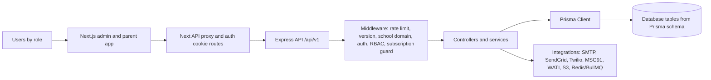

# Document 1 - Executive Application Overview

Generated from repository code on 2026-06-04. Source root: `/Users/syedaabidahamedarshad/Documents/TechStageIT/SchoolApp`.

## Application Purpose

The code implements a multi-tenant school management platform. The frontend is a Next.js admin/parent portal; the backend is an Express API backed by Prisma models. Implemented modules cover school onboarding, users, academic setup, students, attendance, exams, fees, staff/payroll, homework, library, transport, dormitory, reports, notifications, subscriptions, support, audit, and compliance.

## Core Business Function

Manage school administrative operations and role-specific access for platform administrators, school administrators, employees, teachers, parents, and related staff roles.

## User Types

- `SUPER_ADMIN`
- `SCHOOL_ADMIN`
- `TEACHER`
- `ACCOUNTANT`
- `LIBRARIAN`
- `STAFF`
- `PARENT`

## Technology Stack

| Layer | Evidence | Source |
|---|---|---|
| Frontend | Next.js 16, React 18, TypeScript, Tailwind, React Query, Axios | `admin/package.json` |
| Backend | Express, TypeScript, Prisma Client, JWT, Helmet, CORS, Swagger UI | `backend/package.json`, `backend/src/app.ts` |
| Database ORM | Prisma schema with 142 models and 60 enums | `backend/prisma/schema.prisma` |
| Messaging/Storage | Nodemailer, SendGrid, Twilio, MSG91, WATI, AWS S3 | `backend/src/notifications/*`, `backend/src/services/s3.service.ts` |
| Cache/Queues | Redis/ioredis and BullMQ dependencies/services | `backend/package.json`, `backend/src/services/cache/*` |

## Major Modules

| Module | Purpose | API Prefixes | Primary Roles |
|---|---|---|---|
| Platform Administration | Schools, users, subscriptions, platform support, audit, system health | /api/v1/admin/* | SUPER_ADMIN |
| Authentication & Security | Login, refresh/logout, MFA, TOTP, sessions, password reset | /api/v1/auth/* | All authenticated roles |
| Institution Setup & Branding | School profile, settings, themes, login experience, messaging configuration | /api/v1/system-settings, /api/v1/themes, /api/v1/features, /api/v1/messaging-services | SCHOOL_ADMIN, SUPER_ADMIN |
| Academics & Timetable | Academic years, terms, classes, sections, subjects, rooms, periods, routines, timetable versions | /api/v1/academics, /api/v1/academic-setup | SCHOOL_ADMIN, TEACHER read/self |
| Student Information | Student CRUD, parents, photos, documents, groups, categories, promotion, transfers, disabled students | /api/v1/students/* | SCHOOL_ADMIN |
| Attendance & Leave | Student attendance, attendance sessions, approvals, teacher self attendance, substitutions, staff attendance, leave workflow | /api/v1/attendance, /api/v1/students/attendance, /api/v1/leave | SCHOOL_ADMIN, TEACHER, STAFF via permissions |
| Teachers & Staff / Payroll | Teacher and staff profiles, assignments, documents, timeline, attendance, payroll | /api/v1/teachers, /api/v1/staff, /api/v1/teacher-assignments | SCHOOL_ADMIN, employee roles via permissions |
| Fees | Particulars, fee types, structures, assignment, invoices, payments, receipts, ledger, discounts, fines, reports | /api/v1/fees/* | SCHOOL_ADMIN, ACCOUNTANT via permissions |
| Homework | Homework creation, attachments, evaluations, evaluation report | /api/v1/homework/* | SCHOOL_ADMIN, TEACHER via permissions |
| Library | Book categories, books, members, issue/return, issued report | /api/v1/library/* | SCHOOL_ADMIN, LIBRARIAN via permissions |
| Transport | Routes, vehicles, route-vehicle links, student assignments, report | /api/v1/transport/* | SCHOOL_ADMIN |
| Dormitory | Dormitories, room types, rooms, student assignments, report | /api/v1/dormitories/* | SCHOOL_ADMIN |
| Exams & Marks | Exams, exam types/config, grading, exam papers, marks, moderation, revaluation, rank card gap | /api/v1/exams, /api/v1/reports | SCHOOL_ADMIN, TEACHER via permissions |
| Notifications & Messaging | Templates, logs, dispatch, SMS/email/WhatsApp provider config | /api/v1/notifications, /api/v1/admin/messaging-services | SCHOOL_ADMIN, SUPER_ADMIN |
| Compliance & Audit | Consent records, data export/deletion jobs, audit logs, audit exports | /api/v1/consents, /api/v1/compliance, /api/v1/audit-logs | SCHOOL_ADMIN, SUPER_ADMIN |
| Parent Portal | Parent login/OTP, child profile, attendance, subjects, timetable, exams, fees, notices | /api/v1/parents/portal, /api/v1/otp | PARENT |

## High-Level Architecture

