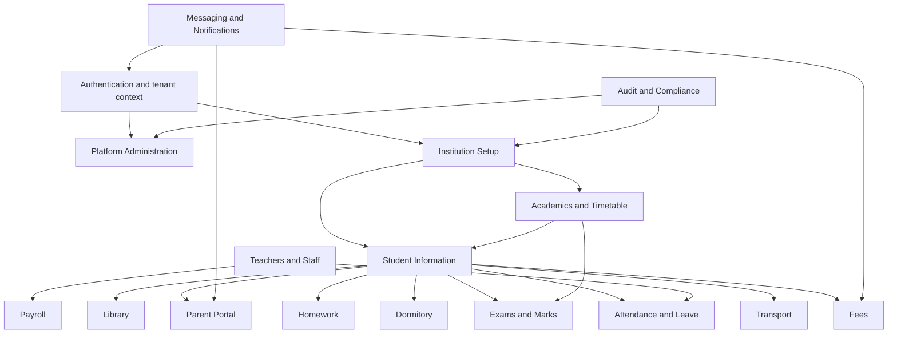

# Document 7 - Feature Dependency Map

Generated from repository code on 2026-06-04. Source root: `/Users/syedaabidahamedarshad/Documents/TechStageIT/SchoolApp`.

## High-Level Dependencies

## Feature to Related Features

| Feature | Related Features | Evidence |
|---|---|---|
| Platform Administration | School, User, Subscription, SubscriptionPlanDef, AuditLog, SupportTicket, BackupJob, RestoreJob | APIs: `/api/v1/admin/*`; tables: `School`, `User`, `Subscription`, `SubscriptionPlanDef`, `AuditLog`, `SupportTicket`, `BackupJob`, `RestoreJob` |
| Authentication & Security | User, RefreshSession, PasswordResetToken, MfaChallenge, TotpCredential, TotpBackupCode | APIs: `/api/v1/auth/*`; tables: `User`, `RefreshSession`, `PasswordResetToken`, `MfaChallenge`, `TotpCredential`, `TotpBackupCode` |
| Institution Setup & Branding | School, Theme, ThemeHistory, ConfigEntry, SchoolSystemSetting, MessagingService, SchoolMessagingConfig | APIs: `/api/v1/system-settings, /api/v1/themes, /api/v1/features, /api/v1/messaging-services`; tables: `School`, `Theme`, `ThemeHistory`, `ConfigEntry`, `SchoolSystemSetting`, `MessagingService`, `SchoolMessagingConfig` |
| Academics & Timetable | AcademicYear, Term, Class, Section, Subject, ClassRoom, TimePeriod, ClassRoutine | APIs: `/api/v1/academics, /api/v1/academic-setup`; tables: `AcademicYear`, `Term`, `Class`, `Section`, `Subject`, `ClassRoom`, `TimePeriod`, `ClassRoutine`, `TimetableVersion`, `TimetableEntry` |
| Student Information | Student, ParentGuardian, StudentParent, StudentEnrollment, StudentGroup, StudentCategory, StudentPromotion, StudentTransferRequest | APIs: `/api/v1/students/*`; tables: `Student`, `ParentGuardian`, `StudentParent`, `StudentEnrollment`, `StudentGroup`, `StudentCategory`, `StudentPromotion`, `StudentTransferRequest`, `StudentDocument`, `StudentTimeline` |
| Attendance & Leave | StudentAttendance, StudentAttendanceSession, StudentAttendanceRecord, AttendanceSession, AttendanceRecord, TeacherSelfAttendance, StaffAttendance, LeaveApplication | APIs: `/api/v1/attendance, /api/v1/students/attendance, /api/v1/leave`; tables: `StudentAttendance`, `StudentAttendanceSession`, `StudentAttendanceRecord`, `AttendanceSession`, `AttendanceRecord`, `TeacherSelfAttendance`, `StaffAttendance`, `LeaveApplication`, `LeaveStatusHistory` |
| Teachers & Staff / Payroll | TeacherProfile, Department, Designation, StaffPayrollInfo, TeacherClassAssignment, TeacherSubjectAssignment, Payroll, PayrollPayment | APIs: `/api/v1/teachers, /api/v1/staff, /api/v1/teacher-assignments`; tables: `TeacherProfile`, `Department`, `Designation`, `StaffPayrollInfo`, `TeacherClassAssignment`, `TeacherSubjectAssignment`, `Payroll`, `PayrollPayment` |
| Fees | FeeParticular, FeeType, FeeStructure, StudentFeeAssignment, FeeInvoice, FeePayment, FeeReceipt, FeeLedger | APIs: `/api/v1/fees/*`; tables: `FeeParticular`, `FeeType`, `FeeStructure`, `StudentFeeAssignment`, `FeeInvoice`, `FeePayment`, `FeeReceipt`, `FeeLedger`, `FeeDiscount`, `FeeFine` |
| Homework | Homework, HomeworkEvaluation | APIs: `/api/v1/homework/*`; tables: `Homework`, `HomeworkEvaluation` |
| Library | LibraryBookCategory, LibraryBook, LibraryMember, LibraryIssue | APIs: `/api/v1/library/*`; tables: `LibraryBookCategory`, `LibraryBook`, `LibraryMember`, `LibraryIssue` |
| Transport | TransportRoute, TransportVehicle, TransportRouteVehicle, StudentTransportAssignment | APIs: `/api/v1/transport/*`; tables: `TransportRoute`, `TransportVehicle`, `TransportRouteVehicle`, `StudentTransportAssignment` |
| Dormitory | Dormitory, DormitoryRoomType, DormitoryRoom, StudentDormitoryAssignment | APIs: `/api/v1/dormitories/*`; tables: `Dormitory`, `DormitoryRoomType`, `DormitoryRoom`, `StudentDormitoryAssignment` |
| Exams & Marks | Exam, ExamTypeConfig, ExamGradingSetting, ExamPaper, Mark, MarkModeration, MarkRevaluation | APIs: `/api/v1/exams, /api/v1/reports`; tables: `Exam`, `ExamTypeConfig`, `ExamGradingSetting`, `ExamPaper`, `Mark`, `MarkModeration`, `MarkRevaluation` |
| Notifications & Messaging | NotificationTemplate, NotificationLog, MessagingService, SchoolMessagingConfig | APIs: `/api/v1/notifications, /api/v1/admin/messaging-services`; tables: `NotificationTemplate`, `NotificationLog`, `MessagingService`, `SchoolMessagingConfig` |
| Compliance & Audit | ConsentDocument, ConsentRecord, DataExportJob, DataDeletionJob, AuditLog, AuditExport | APIs: `/api/v1/consents, /api/v1/compliance, /api/v1/audit-logs`; tables: `ConsentDocument`, `ConsentRecord`, `DataExportJob`, `DataDeletionJob`, `AuditLog`, `AuditExport` |
| Parent Portal | ParentProfile, StudentParent, Student, StudentAttendance, Mark, FeeInvoice, NotificationLog | APIs: `/api/v1/parents/portal, /api/v1/otp`; tables: `ParentProfile`, `StudentParent`, `Student`, `StudentAttendance`, `Mark`, `FeeInvoice`, `NotificationLog` |
