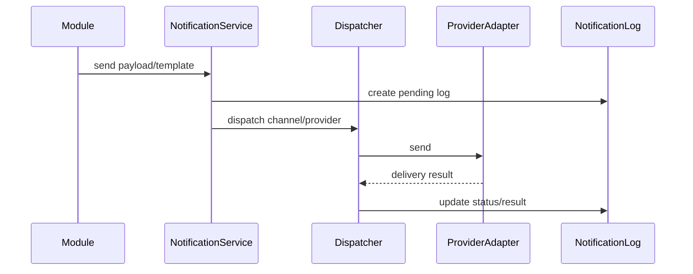

# Document 11 - Integrations Documentation

Generated from repository code on 2026-06-04. Source root: `/Users/syedaabidahamedarshad/Documents/TechStageIT/SchoolApp`.

| Integration | Purpose | Configuration / Source | Modules Using It | Failure Handling Evidence |
|---|---|---|---|---|
| SMTP/Nodemailer | Email delivery | `backend/src/notifications/SmtpEmailAdapter.ts`, messaging config | Password reset, notifications, messaging settings | Adapter catches/returns delivery failures. |
| SendGrid | Email delivery via API | `backend/src/notifications/SendGridEmailAdapter.ts` | Notifications/messaging | Adapter returns failure from HTTP/send exceptions. |
| Twilio | SMS/WhatsApp delivery | `backend/src/notifications/TwilioAdapter.ts` | Notifications, OTP/messaging config | Adapter validates credentials and records notification log result. |
| MSG91 | SMS delivery | `backend/src/notifications/Msg91Adapter.ts` | Notifications/OTP/messaging config | Adapter supports HTTP/form delivery and error result. |
| WATI | WhatsApp session message delivery | `backend/src/notifications/WatiAdapter.ts` | WhatsApp notifications | Adapter builds WATI endpoint and records result. |
| AWS S3 | Object upload/signed URL/storage | `backend/src/services/s3.service.ts`, AWS SDK dependency | Student files/uploads, assets where using S3 URLs | Service returns S3 URL/signed URL; system health TODO notes S3 health check gap. |
| Redis/ioredis | Cache and health checks | `backend/src/config/redis.ts`, `backend/src/services/cache/*` | Cache, system health | Cache service has tests and invalidation patterns. |
| BullMQ | Queues | Dependency and system health queue references | Notifications/jobs/system health | Admin dashboard TODO notes queue metrics need centralized names. |
| Payment gateway placeholders | Payment settings/config but no real billing model | `backend/src/controllers/schoolSystemSettings.controller.ts`, `backend/src/services/subscription.service.ts` | Fees/subscriptions settings | Subscription service states billing records are not implemented yet. |

## Notification Flow

