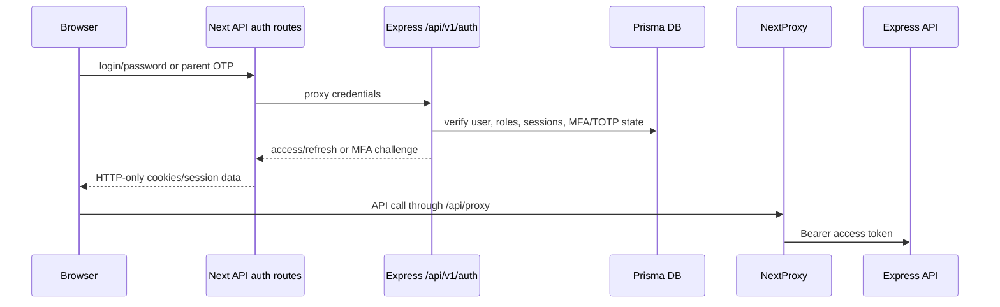

# Document 12 - Security & Access Control Analysis

Generated from repository code on 2026-06-04. Source root: `/Users/syedaabidahamedarshad/Documents/TechStageIT/SchoolApp`.

## Authentication Flow

## Authorization Flow

- `authMiddleware` validates JWT, school status, teacher activity, parent active linked school, and plan permission codes.
- `rbac.middleware.ts` provides `requireRole`, `requirePermission`, and tenant-scope enforcement.
- `superAdminGuard.middleware.ts` protects admin-only platform endpoints.
- `subscriptionGuard.middleware.ts` and app-level write guard constrain writes when subscriptions are invalid.
- Frontend route access and sidebar menu visibility use role and permission codes from the session.

## Sensitive Data Controls

| Control | Source |
|---|---|
| Helmet security headers and CSP | `backend/src/app.ts` |
| CORS allowlist with credentials | `backend/src/app.ts` |
| Rate limiting for global/auth/MFA/forgot password paths | `backend/src/middlewares/rate-limit.middleware.ts` |
| Password hashing and reset tokens | `backend/src/utils/password.ts`, `backend/src/services/passwordReset.service.ts` |
| TOTP credentials and backup codes | `backend/src/services/totp.service.ts`, Prisma TOTP models |
| Audit log sensitive-field masking | `backend/src/services/adminAudit.service.ts` |
| HTTP-only cookie/token handling in Next auth routes | `admin/app/api/auth/*/route.ts` |

## Security Gaps / Notes

- Several auth rate-limit blocks are marked temporarily disabled for demo login recovery in `backend/src/middlewares/rate-limit.middleware.ts`.
- Some operational health checks are TODO in admin dashboard/system health services.
- OTP service currently returns code for stubbed send in `backend/src/services/otp.service.ts`.
