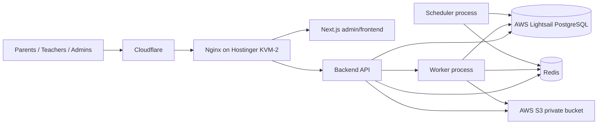
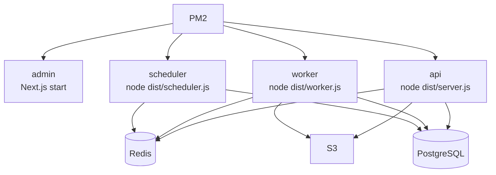
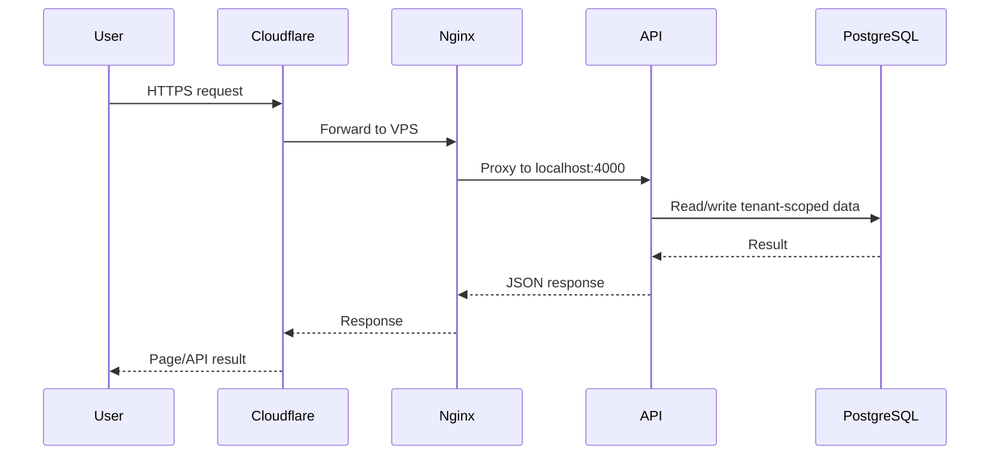
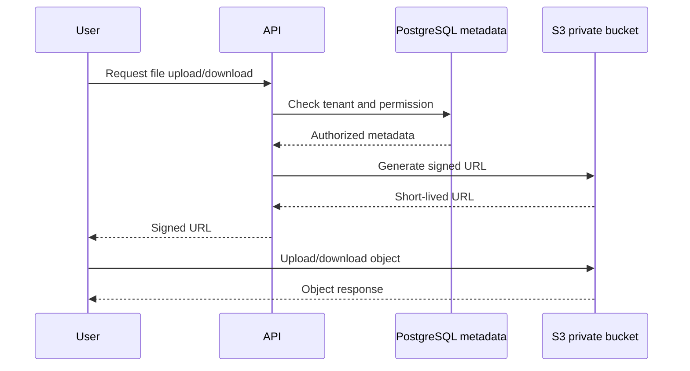
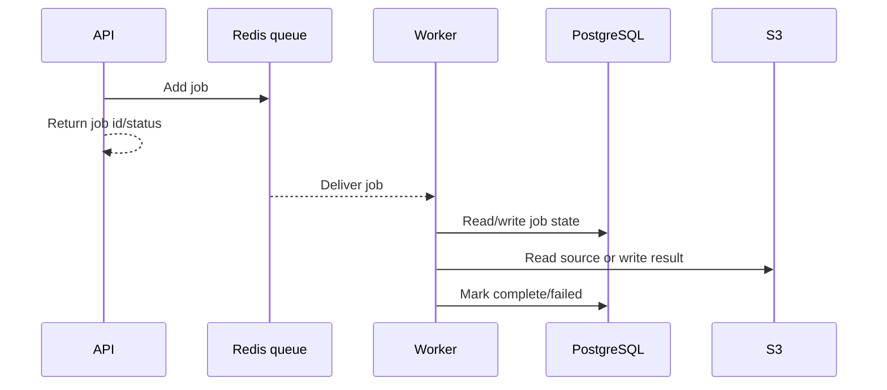
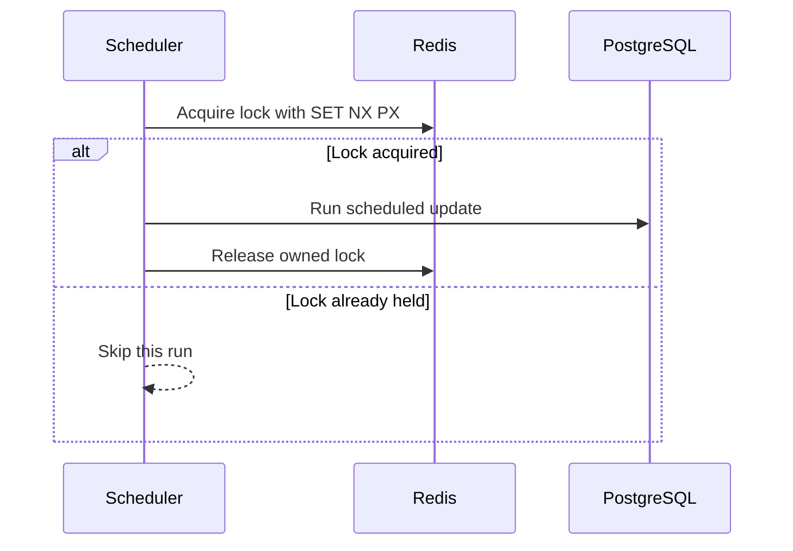
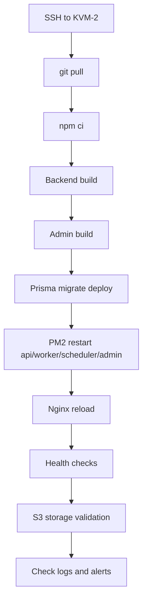
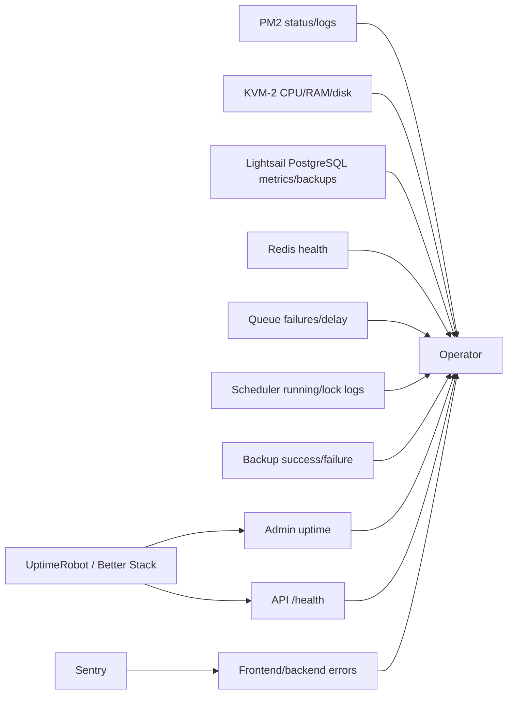
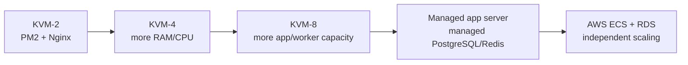

# Academify Architecture Diagrams

Short captions are included so each Mermaid diagram can be read independently.

## High-Level Architecture

Public users reach Cloudflare first, then Nginx on the Hostinger KVM-2 VPS. App processes use external PostgreSQL, private S3, and Redis.

## Process Architecture

PM2 keeps each runtime role separate so API requests, queue work, and scheduled jobs do not compete inside one production process.

## Request Flow

Normal browser/API traffic is routed through Cloudflare and Nginx before reaching the API process.

## File Upload/Download Flow

The API authorizes file access, then returns a signed URL for direct private S3 access.

## Background Worker Flow

The API enqueues work and returns quickly. The worker handles slow work outside the user request.

## Scheduler Lock Flow

Scheduled jobs use Redis locks so a duplicate scheduler process does not run the same job twice.

## Deployment Flow

The PM2 deployment path builds backend/admin, deploys migrations, restarts processes, reloads Nginx, then verifies health and storage.

## Monitoring Flow

External monitors, Sentry, PM2, and provider metrics all feed the operations view.

## Upgrade Path

Start with KVM-2 for pitch/pilot, then increase server size and move managed services out as real usage grows.

