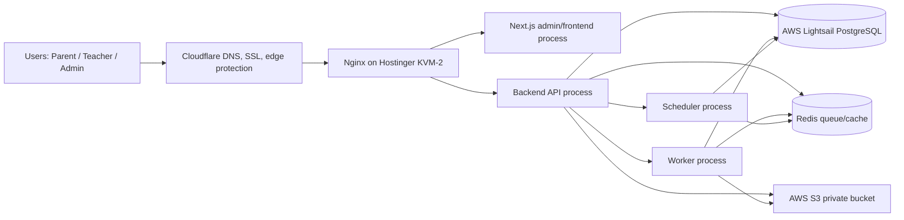
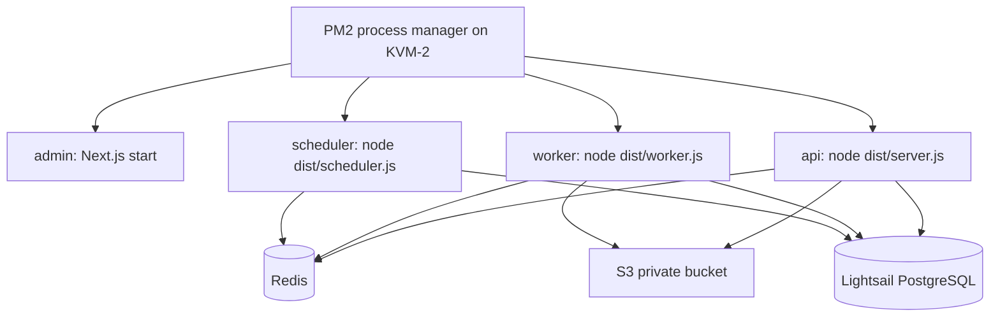
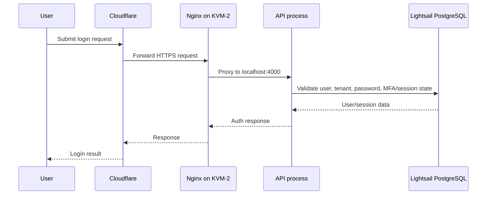
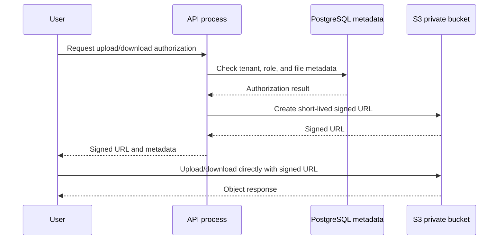
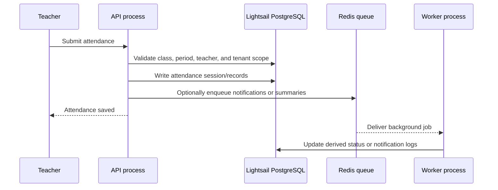
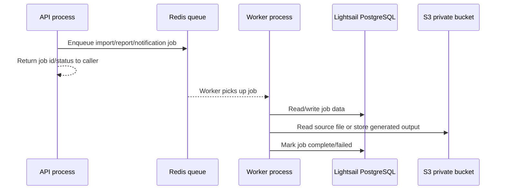
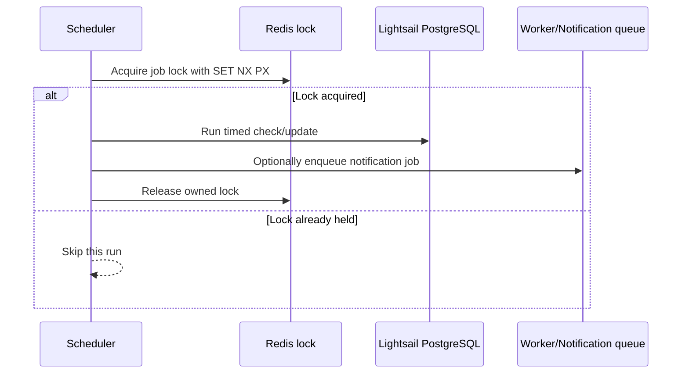
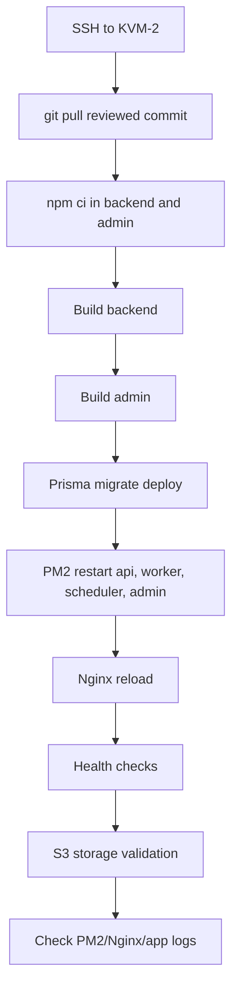
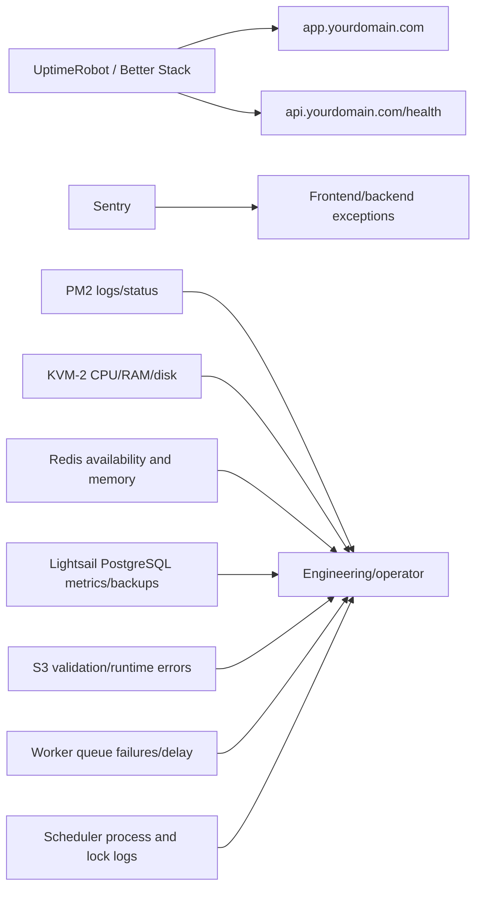
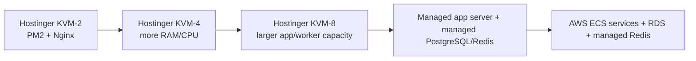

# Academify Hostinger KVM-2 Architecture

## 1. Purpose

This document describes a practical deployment architecture for running Academify on a Hostinger KVM-2 VPS for pitching, demos, and early pilot usage. It is intended for 2-5 schools while the product is proving operations, support, data safety, and real usage patterns.

This is not the final enterprise architecture. The design keeps the first deployment understandable and affordable, while separating the parts that must later scale independently: the web/API process, background workers, scheduler, PostgreSQL, Redis, object storage, backups, and monitoring.

The recommended immediate path for pitching is PM2 plus Nginx on the VPS. The repository also contains `docker-compose.prod-lite.yml`; Docker Compose remains useful for local production-like validation and a future container migration, but PM2 is simpler for the first Hostinger KVM-2 pitch/pilot server.

## 2. Target Scale

| Item | Pilot target |
| --- | --- |
| Schools | 2-5 schools |
| Students per school | 500-1,000 students |
| Total students | 2,500-5,000 students |
| Normal concurrent users | Tens of active users at a time across admins, teachers, and parents |
| Short peak concurrent users | Potentially 100-300 users during school start, attendance, fee reminders, or result publication |

Expected peak moments:

- Morning attendance entry by teachers.
- Result day, when parents and admins open marks/results around the same time.
- Fee due dates, reminder days, and payment reconciliation periods.
- Bulk imports, report exports, notification sends, and document uploads.

KVM-2 is acceptable for this stage if RAM, CPU, queue delay, database connections, and response times are watched. It should not be treated as proof that the same server can carry 10+ active schools without upgrades.

## 3. High-Level Architecture

Cloudflare handles DNS, public HTTPS entry, and basic edge protection. Nginx is the only public entry point on the VPS and routes traffic to private localhost ports. PM2 keeps the Node.js and Next.js processes running. PostgreSQL and S3 stay outside the VPS so school data and files are not tied to the small server disk.

## 4. What Runs On Hostinger KVM-2

| Component | Runs on KVM-2 | Why |
| --- | --- | --- |
| Nginx | Yes | Terminates/proxies HTTPS traffic to internal app ports and enforces request limits. |
| PM2 | Yes | Keeps API, worker, scheduler, and admin/frontend processes online. |
| Next.js admin/frontend process | Yes | Serves `app.yourdomain.com` through Nginx. |
| Backend API process | Yes | Handles user-facing API requests on a private localhost port. |
| Worker process | Yes | Handles queues and heavy background jobs outside the request path. |
| Scheduler process | Yes | Handles timed jobs separately from API and workers. |
| Redis | Usually yes for first KVM-2 pilot | Keeps queues/cache close to the app for low-cost pilot operations. Move to managed Redis as usage grows. |
| Log rotation | Yes | Prevents PM2, Nginx, and app logs from filling the VPS disk. |
| PostgreSQL client tools | Yes | Needed for `pg_dump`, restore drills, and database checks against Lightsail PostgreSQL. |

What should not run on KVM-2 for the target architecture:

- The main PostgreSQL database, because the VPS disk and memory are small and app spikes should not compete directly with the database.
- Permanent file storage, including student photos, homework attachments, documents, imports, exports, and backup dumps.
- Student document storage in a public web directory.
- Large backup archives or long-term backup retention.
- Public Redis or public PostgreSQL ports.

If Redis runs locally during the pilot, bind it to localhost or a private interface only. Do not expose Redis to the internet.

## 5. External Services

| Service | Role |
| --- | --- |
| AWS Lightsail PostgreSQL | Main structured database for schools, users, students, attendance, fees, results, subscriptions, audit logs, and metadata. |
| AWS S3 private bucket | Private object storage for uploads, homework attachments, imports, exports, audit exports, backups, and student files. |
| Cloudflare | DNS, edge TLS, basic DDoS/proxy protection, WAF/rate-limit options, and public domain routing. |
| UptimeRobot or Better Stack | External uptime and health checks for the admin frontend and API health endpoint. |
| Sentry | Backend/frontend exception tracking and release error visibility. |
| Email/SMS/WhatsApp provider | Optional notification delivery provider for OTPs, account onboarding, fee notices, and school messages. |
| External Redis later | Managed Redis or provider-hosted Redis when queue reliability, memory, or VPS capacity becomes a concern. |

## 6. Process Architecture

Academify should run as separate runtime processes in production. The backend package already exposes separate entrypoints:

| Process | Command | Main responsibility |
| --- | --- | --- |
| API | `node dist/server.js` | Login, dashboards, attendance, fees, parent/teacher/admin requests, file authorization, health and metrics endpoints. |
| Worker | `node dist/worker.js` | BullMQ queues, imports, notifications, reports, face processing, heavy background work, and other non-user-blocking tasks. |
| Scheduler | `node dist/scheduler.js` | Timed jobs such as subscription checks, scheduled cleanup, and recurring operational jobs. |
| Admin/frontend | `npm run start` from `admin` after `npm run build` | Next.js app served by PM2 and proxied through Nginx. |

The scheduler must stay separate because scheduled jobs should not run once per API instance when the API is scaled. The current backend uses a Redis-based lock pattern for scheduler jobs, but the clean operational model is still one scheduler process for the pilot and explicit lock validation before running more than one.

Recommended production role settings:

| Process | Role settings |
| --- | --- |
| API | `ACADEMIFY_PROCESS_ROLE=api`, `RUN_API=true`, `RUN_WORKERS=false`, `RUN_SCHEDULERS=false` |
| Worker | `ACADEMIFY_PROCESS_ROLE=worker`, `RUN_API=false`, `RUN_WORKERS=true`, `RUN_SCHEDULERS=false` |
| Scheduler | `ACADEMIFY_PROCESS_ROLE=scheduler`, `RUN_API=false`, `RUN_WORKERS=false`, `RUN_SCHEDULERS=true` |

Do not use `ACADEMIFY_PROCESS_ROLE=all` in production. It is for local development only.

## 7. Request Flow

### A. Login Flow

### B. File Upload/Download Flow

S3 remains private. The API authorizes the user first, then issues a short-lived signed URL. No student files should be public.

### C. Attendance Flow

### D. Background Job Flow

### E. Scheduler Flow

The Redis lock avoids duplicate scheduled work if a second scheduler is started during a migration or future scale test.

## 8. Domain And Reverse Proxy Design

| Public domain | Nginx upstream | Internal target |
| --- | --- | --- |
| `app.yourdomain.com` | Admin/frontend upstream | `http://127.0.0.1:3001` |
| `api.yourdomain.com` | Backend API upstream | `http://127.0.0.1:4000` |

Nginx responsibilities:

- Accept public HTTP/HTTPS traffic for the configured domains.
- Redirect HTTP to HTTPS.
- Proxy admin traffic to the Next.js process.
- Proxy API traffic to the backend API process.
- Set body-size limits using `client_max_body_size`.
- Preserve forwarding headers such as `Host`, `X-Forwarded-For`, and `X-Forwarded-Proto`.
- Keep backend/admin ports private to localhost.

Cloudflare responsibilities:

- DNS records for `app.yourdomain.com` and `api.yourdomain.com`.
- Public SSL/TLS entry and optional proxy mode.
- Basic DDoS protection and optional WAF/rate-limit rules.
- Health-aware monitoring integrations if used.

SSL guidance:

- Use Cloudflare plus Nginx/Certbot or Cloudflare Origin Certificates, depending on the chosen operations model.
- Keep HTTPS-only access for both app and API.
- Avoid exposing `:3001`, `:4000`, Redis, or PostgreSQL ports publicly.

Upload/body-size guidance:

| Flow | Suggested Nginx setting |
| --- | --- |
| Normal JSON/API requests | Small default is fine. |
| Student document uploads through signed URL flow | Keep API body small because file bytes should go to S3 directly. |
| Import CSV/XLSX uploads that pass through API | Set `client_max_body_size` to a reviewed limit such as `20m` or `50m`, based on the import policy. |

## 9. Data Storage Design

| Storage | Purpose | Notes |
| --- | --- | --- |
| PostgreSQL | Structured school data | Stores schools, users, students, attendance, fees, exams, audit logs, subscriptions, and metadata. |
| S3 private bucket | Files and generated artifacts | Stores student documents, homework attachments, imports, exports, audit exports, backups, and other private runtime files. |
| Redis | Queues/cache/transient state | Stores BullMQ queue data, cache entries, and scheduler locks. Redis is not the source of truth. |
| VPS local disk | App code, build output, logs, temp files | Keep disk use small and rotated. Do not store permanent student files here. |

Private file rules:

- Use `STORAGE_DRIVER=s3` for real school data.
- Keep the bucket private.
- Generate short-lived signed URLs only after the API authorizes the user.
- Do not make student files public.
- Do not store raw user filenames as trusted object keys.
- Do not commit uploaded files, generated exports, dumps, or runtime artifacts to git.

## 10. Environment Variables Overview

Use environment files or secret management on the server, but do not commit `.env` files.

Required categories:

| Category | Variables |
| --- | --- |
| Database | `DATABASE_URL` |
| Redis | `REDIS_URL` |
| CORS/frontend | `CORS_ORIGINS`, `FRONTEND_URL`, `NEXT_PUBLIC_API_BASE_URL`, `NEXT_PUBLIC_API_URL` if used by the deployment |
| Auth/session secrets | JWT access/refresh secrets, cookie/session secrets, MFA/TOTP encryption secrets as configured by the backend |
| Runtime roles | `ACADEMIFY_PROCESS_ROLE`, `RUN_API`, `RUN_WORKERS`, `RUN_SCHEDULERS` |
| Storage mode | `STORAGE_DRIVER=s3`, `SIGNED_URL_EXPIRES_SECONDS` |
| S3 | `S3_REGION`, `S3_BUCKET`, `S3_ACCESS_KEY_ID`, `S3_SECRET_ACCESS_KEY`, optional `S3_ENDPOINT`, optional `S3_FORCE_PATH_STYLE` |
| Admin build/runtime | `API_BASE_URL`, `NEXT_PUBLIC_API_BASE_URL`, optional `NEXT_PUBLIC_API_URL` if the deployed admin uses it |
| Observability | Sentry DSN/config, log level, metrics toggles, OpenTelemetry toggles if enabled |
| Providers | Email, SMS, WhatsApp, Firebase, AI provider, or other integration credentials if used |

Warnings:

- Do not commit `.env` files.
- Do not paste secrets, JWTs, cookies, private keys, S3 credentials, database URLs, or full signed URLs into tickets, docs, or chat.
- Use placeholders such as `your-private-s3-bucket`, `app.yourdomain.com`, and `api.yourdomain.com` in documentation.

## 11. Deployment Flow

Recommended PM2 deployment flow for the Hostinger KVM-2 pilot:

1. SSH to the server as the deployment user.
2. Pull the reviewed commit from git.
3. Install dependencies with `npm ci` for `backend` and `admin`.
4. Build the backend with `npm --prefix backend run build`.
5. Build the admin app with `npm --prefix admin run build`.
6. Run `npx prisma migrate deploy` against the configured Lightsail PostgreSQL database.
7. Start or restart PM2 processes for API, worker, scheduler, and admin/frontend.
8. Reload Nginx after config changes.
9. Run health checks for `https://api.yourdomain.com/health` and `https://app.yourdomain.com/`.
10. Run storage validation against the configured S3 bucket without printing secrets or full signed URLs.
11. Check PM2, Nginx, API, worker, scheduler, Redis, and backup logs.

Docker Compose note:

- `docker-compose.prod-lite.yml` already models API, worker, scheduler, Redis, PostgreSQL, admin, and optional MinIO.
- For the requested Hostinger KVM-2 pilot architecture, prefer PM2 with external Lightsail PostgreSQL and S3.
- Keep Docker Compose available for production-like staging, CI validation, or a future migration to container services.

## 12. Backup And Restore Architecture

PostgreSQL backup model:

- Use AWS Lightsail PostgreSQL automated backups/snapshots where available.
- Run a `pg_dump` based backup script on a schedule for additional portable backups.
- Store dumps privately outside the app repo and outside public web paths.
- Keep backup files encrypted/private according to provider capability and access policy.
- Run restore drills into a disposable database before launch and after backup-system changes.

Object storage backup model:

- Keep the S3 bucket private.
- Enable S3 versioning if possible.
- Use lifecycle policies for retention and cost control.
- Test restoring at least one object to a temporary prefix without exposing full signed URLs.

Operational rules:

- Every scheduled backup must produce success/failure evidence.
- Backup failures should alert the engineering/operations owner.
- Restore drills must never target the live production database by accident.
- Do not store large backup archives on the KVM-2 disk long term.

## 13. Monitoring Architecture

Minimum monitoring:

- UptimeRobot or Better Stack check for `app.yourdomain.com`.
- UptimeRobot or Better Stack check for `api.yourdomain.com/health`.
- Sentry for backend and frontend errors.
- PM2 status and logs for API, worker, scheduler, and admin.
- Server CPU, RAM, disk, and load average.
- Redis availability and memory pressure.
- PostgreSQL availability, storage, CPU, connections, and backup status.
- Backup success/failure alerts.
- Worker and scheduler process-running alerts.
- 5xx error and latency alerts.
- Failed login spike alerts.
- Queue failure and queue-delay alerts.

Do not expose `/metrics` publicly unless it is protected by an allowlist, VPN, reverse-proxy auth, or equivalent control.

## 14. Security Architecture

Security controls:

- Cloudflare sits in front of public domains.
- HTTPS-only traffic for admin and API domains.
- Nginx reverse proxy is the public server entry point.
- Firewall allows only SSH from approved operators and public HTTP/HTTPS.
- Backend/admin ports are bound to localhost and are not public.
- PostgreSQL is not public. Allow only required app/server access.
- Redis is not public. Use localhost/private binding or a managed private endpoint.
- S3 bucket is private.
- Files are accessed with signed URLs after API authorization.
- CORS uses explicit origins, never `*` in production.
- Secrets are strong, rotated, and not committed.
- `.env` files are not committed.
- Default super-admin credentials must be rotated, disabled, or confirmed absent before pilot data.
- Tenant isolation is enforced at the API/data layer and smoke-tested with at least two schools.
- RBAC controls are required for admin, school, teacher, parent, and staff actions.
- Audit logs are retained and reviewed for sensitive actions.
- Backups are encrypted/private and access-limited.

## 15. Capacity Expectations

| Stage | Infrastructure expectation | Notes |
| --- | --- | --- |
| Pitch/demo | KVM-2 + Lightsail PostgreSQL + S3 + Redis | Good for demos and low real traffic. Keep sample/demo data separate from real pilot data. |
| 1-2 schools | KVM-2 + Lightsail PostgreSQL + S3 + Redis | Acceptable if monitoring is green and queues are short. |
| 3-5 schools | KVM-2 carefully monitored, or KVM-4 if RAM/CPU pressure appears | This is the upper practical pilot range. Watch attendance and result-day peaks. |
| 5-10 schools | KVM-4 or KVM-8, consider external Redis, tune DB and indexes | Move heavy reports/exports to background jobs and finish frontend pagination. |
| 10+ schools | Managed PostgreSQL/Redis and later AWS ECS/RDS if needed | Scale app, worker, scheduler, DB, and Redis independently. |

KVM-2 is useful for pitching and early pilots because it keeps operations simple. It should be monitored closely and upgraded before slowdowns become normal.

## 16. Upgrade Path

Upgrade sequence:

1. KVM-2 with PM2, Nginx, Lightsail PostgreSQL, S3, and Redis.
2. KVM-4 when app/server resources become tight.
3. KVM-8 when more API/worker capacity is needed but a full platform move is not yet justified.
4. Managed PostgreSQL/Redis when database or queue reliability becomes the main operational risk.
5. AWS ECS/RDS when separate API, worker, scheduler, and database scaling are needed.

Upgrade triggers:

- RAM stays above 75-80%.
- CPU stays high for sustained periods.
- API p95 latency is slow during normal usage.
- Report/export/import jobs are heavy.
- Worker queue delay grows or jobs fail repeatedly.
- Disk pressure appears from logs or temporary files.
- PostgreSQL connections or slow queries become frequent.
- 5+ active schools use the system regularly.
- 10+ active schools are planned or signed.

## 17. Pilot Readiness Checklist

- [ ] Domain configured for `app.yourdomain.com` and `api.yourdomain.com`.
- [ ] SSL/HTTPS enabled and renewal path verified.
- [ ] API health check working.
- [ ] PM2 processes online for API, worker, scheduler, and admin.
- [ ] Redis is reachable and not public.
- [ ] S3 validation passed.
- [ ] Database migration deployed with `prisma migrate deploy`.
- [ ] Backup completed and restore drill passed against a disposable database.
- [ ] Monitoring alerts configured.
- [ ] Default super-admin remediated.
- [ ] Test school created.
- [ ] School admin login tested.
- [ ] Teacher login tested.
- [ ] Parent login tested.
- [ ] Attendance flow tested.
- [ ] File upload/download with signed URLs tested.
- [ ] Tenant isolation smoke tested with at least two schools.
- [ ] PM2/Nginx log rotation configured.
- [ ] No `.env` file or real secret committed.

## 18. Known Limitations

- KVM-2 is not the final enterprise architecture.
- Heavy reports still need background processing as real usage grows.
- Frontend pagination should be completed for all high-volume views.
- Real load testing is still required before onboarding more schools.
- Managed PostgreSQL and managed Redis are recommended as usage grows.
- Staging execution must be completed before real school data is loaded.
- Redis on the VPS is acceptable for a pilot, but it creates a server-local queue dependency.
- The deployment still needs real domain, SSL, firewall, backup, and alert values filled by the operator.

## 19. Glossary

| Term | Meaning |
| --- | --- |
| VPS | A virtual private server. Here, the Hostinger KVM-2 server that runs Nginx, PM2, app processes, logs, and possibly Redis. |
| Process | A running program on the server, such as the API or worker. |
| API process | The backend HTTP server that handles user requests and talks to PostgreSQL, Redis, and S3. |
| Worker process | A backend process that consumes queue jobs for imports, notifications, reports, and other background work. |
| Scheduler process | A backend process that runs timed jobs such as subscription checks and scheduled cleanup. |
| Reverse proxy | A public web server that receives requests and forwards them to internal app processes. Nginx is the reverse proxy here. |
| Redis | An in-memory data store used for queues, cache, transient state, and scheduler locks. |
| S3 | AWS object storage used for private files and generated artifacts. |
| Signed URL | A short-lived URL that grants temporary access to a private object after the API authorizes the user. |
| PM2 | A Node.js process manager that starts, restarts, logs, and monitors app processes. |
| Nginx | A web server/reverse proxy that routes public traffic to internal app ports and applies request limits. |
| Cloudflare | DNS, TLS, and edge protection layer in front of the VPS. |

## 20. Final Pilot Deployment Decision

The recommended first pilot setup for Academify is:

- Hostinger KVM-2 as the application server.
- PM2 for process management.
- Nginx as the reverse proxy.
- AWS Lightsail PostgreSQL as the external database.
- AWS S3 private bucket for file storage.
- Redis on the VPS for the pilot stage.
- Cloudflare for DNS, SSL, and edge protection.
- UptimeRobot or Better Stack for uptime monitoring.
- Sentry for error tracking.

This setup is approved for pitching and limited pilot usage with 2-5 schools only if:

- S3 validation passes.
- Database backup and restore drill passes.
- PM2 processes restart after reboot.
- HTTPS is configured.
- API health monitoring is active.
- Default super-admin remediation is completed.
- Tenant isolation smoke test passes.

Upgrade should be planned when any of these triggers appear:

- RAM stays above 75-80%.
- CPU is high for sustained periods.
- API response times become slow.
- Worker queue delay grows.
- Reports or exports become heavy.
- 5+ active schools use the system regularly.
- 10+ schools are planned.
